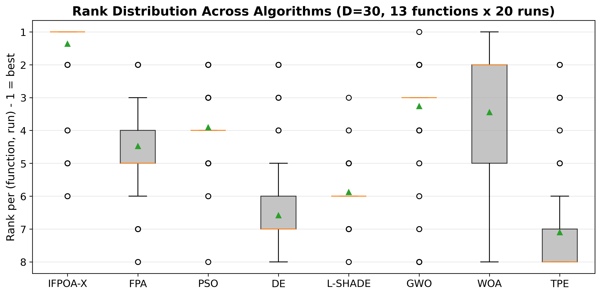
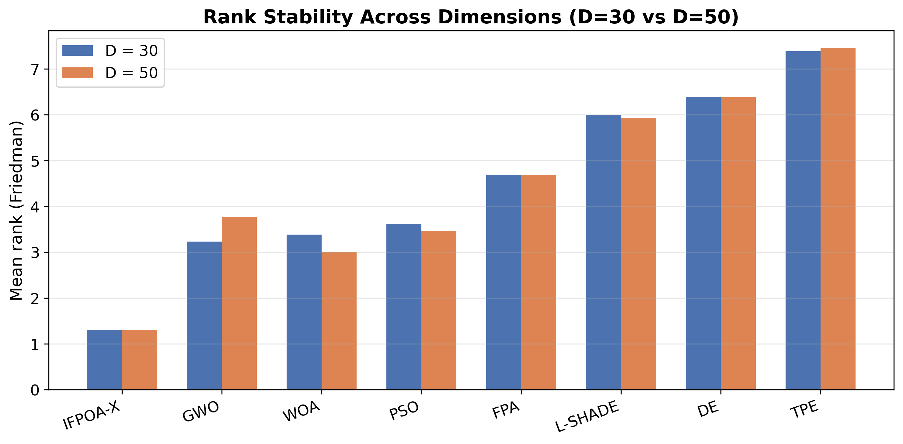

# When Does Opposition-Based Learning Actually Help? An Origin-Bias-Controlled Study of a Hybrid Flower Pollination Algorithm (IFPOA-X) under Tight Evaluation Budgets

**Authors:** [Tonny Wahyu Aji], [Marzuki Sinambela], [Edward Trihadi], [Hapsoro Agung Nugroho]

**Affiliation:** [STMKG]

**Target venue:** [Journal of Heuristics / Evolutionary Intelligence / Swarm and Evolutionary Computation]

---

## Abstract

A low-budget performance advantage measured for a metaheuristic under a fair, equal-evaluation protocol may reflect a genuine algorithmic property, or merely an alignment between the algorithm's search mechanism and the geometry of the benchmark suite — a distinction the literature rarely tests. We investigate this using **IFPOA-X**, a hybrid, opposition-based Flower Pollination Algorithm built for the low-budget regime, augmenting FPA with three mechanisms: an Upper Confidence Bound (UCB1) bandit for operator selection, Opposition-Based Learning (OBL), and a JADE-style adaptive local search. Against seven baselines (FPA, PSO, DE, L-SHADE, GWO, WOA, and a Bayesian-Optimization baseline, TPE) on the classical F1–F13 suite at D ∈ {30, 50} under a strict 500-evaluation *equal-NFE* protocol over 20 runs, IFPOA-X attains the best mean Friedman rank (**1.31**, 12/13 Wilcoxon wins per baseline, p < 0.05). A 20-run ablation across all 13 functions shows this advantage is driven almost entirely by OBL (12/13), while the bandit is statistically undetectable (12/13 ties) and JADE is *counter-productive* (11/13). Since OBL reflects candidates through the domain centre — where the classical optima cluster — we re-test under **four independent origin-bias controls** (a custom shift, the standard CEC2017 shifted-and-rotated suite, and two further shifts). The advantage does not survive: IFPOA-X's rank collapses to **5.23–5.77 (5th–6th of 8)** under *every* control, agreeing to within half a rank position even as different baselines (WOA or GWO) come to lead. We conclude that this advantage is substantially an artifact of origin-centred benchmark geometry, and argue that any OBL-based low-budget claim should be validated against a shifted control before it is believed.

**Keywords:** opposition-based learning; benchmark validity; origin bias; flower pollination algorithm; metaheuristic optimization; ablation study; low-budget optimization; equal-NFE evaluation protocol.

---

## 1. Introduction

Optimization of complex, nonlinear, and often non-differentiable objective functions is a fundamental challenge in engineering design, machine learning, and scientific computing. When gradient information is unavailable, unreliable, or prohibitively expensive to obtain, derivative-free global optimization becomes essential. Nature-inspired population-based metaheuristics — including Particle Swarm Optimization (PSO) [15], Differential Evolution (DE) [14], and the Flower Pollination Algorithm (FPA) [1] — have been widely adopted because they require no gradient information, are conceptually simple, and generalize across problem domains.

Despite their popularity, metaheuristics exhibit two persistent failure modes. First, **premature convergence** on rugged, multimodal landscapes remains a well-documented limitation: FPA in particular is characterized by a *static* Lévy step scale and a *fixed* switching probability between global and local search, and a substantial body of work has proposed chaotic maps [3], dynamic switching, and pollinator-attraction biases [6] specifically to counter its tendency to stagnate in local optima (see §2.1 for a full synthesis). Second, competitive solution quality typically demands a **large number of function evaluations (NFE)** — tens or hundreds of thousands of evaluations are standard practice in the benchmarking literature [24] — a requirement that is rarely questioned in algorithm comparisons even though it fundamentally limits practical applicability.

In many real-world scenarios, however, each function evaluation is itself computationally expensive. A single hyperparameter configuration of a deep neural network can require anywhere from tens of minutes to several days of training and validation before its quality is known, and high-fidelity engineering simulations incur comparable cost [20]. Under such conditions only a small evaluation budget — typically on the order of hundreds, not tens of thousands, of evaluations — is practically affordable, so **sample efficiency**, not asymptotic convergence at unlimited budget, determines real-world success. Bayesian Optimization, which builds a probabilistic surrogate model of the objective to guide the search, has become a leading approach precisely because it is designed for this sample-efficient, expensive-black-box regime [20]. Surrogate-assisted evolutionary algorithms extend the same principle to population-based search by screening candidates through a cheap meta-model before committing to an expensive true evaluation [18, 19], while multi-fidelity methods such as Hyperband and its asynchronous variant ASHA attack the same problem from a different angle, aggressively early-stopping unpromising configurations using low-fidelity approximations [22, 23]. Taken together, this literature establishes that the cheap-evaluation, large-budget regime in which most metaheuristics are designed and benchmarked is a poor proxy for the expensive-evaluation, tight-budget regime that governs many real optimization problems.

**Why 500 evaluations.** This paper adopts a deliberately extreme budget of $\mathrm{NFE}_{\max} = 500$ real function evaluations as its evaluation ceiling — roughly **one to two orders of magnitude smaller** than the $10^4$–$10^5$ evaluations conventionally used to benchmark metaheuristics on the very same $F_1$–$F_{13}$ suite [24]. The intent is to *simulate* an expensive-evaluation setting: if a single evaluation is illustratively assumed to cost only ten minutes of compute — already optimistic for training a non-trivial deep-learning model or running a high-fidelity simulation [18, 20] — a budget of 500 evaluations already totals over 80 continuous compute-hours (more than three days) for a *single* optimization run, and realistic hyperparameter-optimization workloads frequently cost far more per evaluation than that. A budget beyond a few hundred evaluations is therefore often simply unaffordable within the time constraints of an actual research or engineering project. Testing every compared algorithm at exactly this budget removes the option of "winning by brute force" over many evaluations and forces a genuine test of how much solution quality an algorithm can extract per evaluation — which is the property this paper is designed to measure.

Yet FPA and most modern metaheuristics are rarely designed or evaluated under a strict, low-budget, equal-NFE protocol, and few approaches integrate adaptive operator control, opposition-based learning, and surrogate screening within a single framework aimed at sample efficiency (§2 develops this gap in full). Compounding this, the No Free Lunch theorem [25] establishes that no optimizer dominates across all problem classes, so broad, fair benchmarking under a controlled evaluation budget — rather than a handful of favorable cases — is required to draw meaningful conclusions about an algorithm's advantage [27].

A further, more specific question motivates this paper and is rarely asked in the metaheuristics literature: even a low-budget advantage measured under a *fair, equal-NFE* protocol could still be an artifact of the benchmark suite's own geometry rather than a general property of the algorithm. Opposition-Based Learning (OBL) is a natural candidate mechanism to probe this with, because it operates by reflecting candidates through the domain centre — a design choice whose effectiveness could plausibly depend on *where* a benchmark's optima happen to sit, independent of an algorithm's actual search quality. This paper therefore asks, and answers with a controlled experiment (§5.7) rather than speculation: **when does OBL actually help, and is a measured low-budget advantage attributable to the algorithm or to alignment with benchmark geometry?**

To investigate this, we build and study **IFPOA-X**, a hybrid Flower Pollination Algorithm designed for global optimization under a strict budget of roughly 500 real function evaluations, both as a genuine algorithmic contribution and as the experimental vehicle for the audit above. IFPOA-X augments standard FPA with four mechanisms, whose *individual* contributions under this tight budget are then measured directly rather than assumed (§5.4):

1. A **UCB1 multi-armed bandit** [11] for adaptive operator selection, which dynamically allocates search effort between global and local operators based on observed reward;
2. **Opposition-Based Learning** [8] to broaden population coverage and escape local optima;
3. A **JADE-style** [9] adaptive local search with success-history parameter control, replacing FPA's uniform random local walk; and
4. An optional **k-NN surrogate screen combined with ASHA-style multi-fidelity pruning** [22, 23] to avoid wasting expensive evaluations on unpromising candidates (part of the general IFPOA-X framework; disabled in the analytical benchmark of this paper, see §3.4).

IFPOA-X is evaluated against seven baselines — FPA [1], PSO [15], DE [14], L-SHADE [10], GWO [16], WOA [17], and TPE [21] (a Bayesian-Optimization baseline) — on the classical $F_1$–$F_{13}$ suite [24] at dimensions $D \in \{30, 50\}$ under a strict equal-NFE protocol.

**Contributions.** The four contributions below build toward the last one, which we consider the paper's primary contribution and the direct answer to the question posed above.

* The **IFPOA-X algorithm**, which combines bandit-based adaptive operator selection, opposition-based learning, and JADE-style adaptive local search on an FPA backbone (with an optional surrogate/ASHA screen for the expensive- evaluation regime that is *not* exercised in this paper, see §3.4).
* A **rigorous equal-NFE benchmark** comparing IFPOA-X against classical (FPA, PSO, DE), modern (L-SHADE, GWO, WOA), and Bayesian-Optimization (TPE) baselines under a deliberately tight budget of ~500 evaluations, with a full Wilcoxon + Friedman + Nemenyi Critical-Difference [26] statistical treatment.
* A **component ablation that reports a negative-and-instructive result**: at ~500 evaluations the measured advantage comes almost entirely from OBL, while the UCB1 bandit contributes nothing statistically detectable and the JADE-style local search is *counter-productive*. We frame this as a general cautionary finding for the field — adaptive operator-control mechanisms validated at conventional budgets can fail to pay off, or actively hurt, when transplanted into the ultra-low-budget regime without an evaluation warm-up — rather than hide it behind the aggregate ranking.
* An **origin-bias control experiment** (§5.7), motivated directly by the ablation finding above: since OBL is both the dominant contributor and a centre-reflection mechanism, we constructed a shifted variant of F1–F13 with every optimum displaced away from the domain centre and re-ran the full equal-NFE protocol. IFPOA-X's rank-1 advantage **does not survive** this control (falling to 6th of 8 algorithms), which we report as the paper's central finding: it demonstrates, with the same statistical rigor used to establish the original advantage, that the advantage is substantially suite-geometry-dependent rather than general-purpose — a validity check we believe should become standard practice for OBL-based metaheuristics, most of which are validated only on origin-centred suites.

The remainder of this paper is organized as follows. Section 2 reviews related work; Section 3 details the IFPOA-X algorithm; Section 4 presents the experimental setup; Section 5 reports results and discussion; Section 6 concludes.

---

## 2. Related Work

> **Provenance note.** Every reference below was retrieved and verified through Scite. For each work the citation–claim link was checked against Scite Smart Citations (supporting / contrasting / mentioning), and each record was screened for retractions, corrections, or editorial concerns — none of the selected works carry such notices. Two anchor roles could not be linked to a clean, DOI-registered record in Scite and were therefore re-anchored on verifiable substitutes rather than guessed: the tree-structured Parzen estimator (originally Bergstra et al., NeurIPS 2011, no DOI in index) is cited via the DOI-registered Hyperopt paper that implements it [21]; and Demšar's 2006 JMLR paper on statistical comparison (no crossref DOI) is represented by the metaheuristic-specific tutorial of Derrac et al. [26], which operationalizes the same Wilcoxon/Friedman machinery. Smart Citation tallies are listed with every reference so reliability can be judged directly.

### 2.1 The Flower Pollination Algorithm and its variants

The Flower Pollination Algorithm (FPA), introduced by Yang [1], idealizes biotic cross-pollination as global search via Lévy flights and abiotic self-pollination as local search, switching between the two with a fixed probability *p*; on classical test functions it was reported to converge faster than genetic algorithms and particle swarm optimization, and its convergence to the optimal set was later established through a discrete-time Markov-chain analysis [2]. Its structural simplicity and small parameter count made it a popular base for improvement, but the same body of work repeatedly exposes three recurring weaknesses: premature convergence and entrapment in local optima, a *static* Lévy step scaling that is too small for fast progress yet too large to refine, and a *fixed* switch probability that cannot rebalance exploration and exploitation as search proceeds. Variants target these directly. Arora and Anand [3] inject chaotic maps wherever the canonical FPA draws a random number, improving convergence rate and local-optima avoidance, though at the cost of map-selection sensitivity. Kamboh et al. [4] replace the constant *p* with a *dynamic switch probability* and add a swap operator for population diversity, outperforming the standard FPA and several nature-inspired peers, but only on low-dimensional benchmarks. Kopciewicz and Łukasik [5] strip FPA down to a purely biotic "flower-constancy" variant (BFPA) that beats the original on CEC'17, while Mergos and Yang [6] add a pollinator-attraction bias that yields statistically significant gains on CEC'13 — each, however, improves one mechanism in isolation rather than addressing the joint failure of step size and switching. A complementary tuning study by the same authors [7] shows the "best" FPA parameters depend strongly on the objective, the dimension, and the affordable budget, which both motivates adaptive control and warns that hand-tuned FPA variants generalize poorly. Across this literature the evaluation budgets are large and the control of operators remains largely hand-designed, leaving open how FPA should behave when function evaluations are scarce.

### 2.2 Exploration–exploitation enhancement mechanisms

Three lines of work supply the mechanisms IFPOA-X hybridizes. First, Opposition-Based Learning (OBL), introduced by Tizhoosh [8], evaluates a candidate together with its opposite and keeps the better, accelerating convergence by improving the expected quality of sampled points; it has since been embedded in numerous metaheuristics as an initialization and generation-jumping accelerator, its main limitation being that naïve opposition can waste evaluations once the population has already localized. Second, adaptive Differential Evolution provides the template for success-history control: JADE [9] adapts mutation and crossover parameters online using an optional archive of recently successful solutions, and L-SHADE [10] extends this success-history adaptation with linear population-size reduction, remaining one of the strongest DE variants on the CEC benchmarks — the caveat being that both were designed and validated under generous evaluation budgets. Third, adaptive operator selection (AOS) casts the choice among operators as a multi-armed bandit problem. The finite-time analysis of the Upper Confidence Bound (UCB1) policy by Auer et al. [11] gives the logarithmic-regret guarantee that makes bandit control attractive, and DaCosta et al. [12] first brought this into evolutionary computation with a *dynamic* multi-armed bandit that couples UCB with a change-detection test, since the best operator drifts over a run; Fialho et al. [13] systematized and analyzed these bandit-based AOS schemes, showing they dominate probability-matching and adaptive-pursuit rules. Their shared limitation, relevant here, is that bandit-based AOS has been studied mostly on combinatorial or artificial credit-assignment scenarios and under many operator trials, not under the tight evaluation ceilings this paper targets.

### 2.3 Modern population-based baselines

The baselines against which IFPOA-X must be judged are the workhorses of continuous global optimization. Differential Evolution [14] and Particle Swarm Optimization [15] remain the canonical population-based optimizers and, in their adaptive descendants such as L-SHADE [10], continue to top competitive benchmarks; their weakness is a well-documented sensitivity to control parameters that adaptive variants only partially remove. Among the "swarm" successors, the Grey Wolf Optimizer and the Whale Optimization Algorithm are the most cited: GWO [16] models an alpha–beta–delta leadership hierarchy and reports competitive results against PSO, DE, and evolution strategies on 29 functions, while WOA [17] mimics humpback bubble-net encircling and is likewise benchmarked as competitive on classical suites. Both enjoy enormous adoption, yet their standing is contested — a substantial critical literature argues that many such metaphor-named methods add little algorithmic novelty and that their reported superiority often reflects weak baselines or lenient protocols rather than genuine advantage (see §5). For the present study these algorithms matter precisely as *fair* reference points: strong when evaluations are plentiful, but rarely characterized under a strict, low-budget, equal-NFE regime.

### 2.4 Expensive and sample-efficient optimization

When each evaluation is costly, the field turns from raw population dynamics to models that spend evaluations wisely. Surrogate-assisted evolutionary algorithms (SAEAs), surveyed by Jin [18], replace part of the expensive objective with a cheap meta-model and manage the resulting approximation error through infill/model-management strategies; Chugh et al. [19] exemplify the state of the art with a Kriging-assisted, reference-vector-guided algorithm for computationally expensive problems, though Kriging-based SAEAs scale poorly beyond low dimensions and modest objective counts. A parallel thread comes from AutoML: Bayesian Optimization, reviewed by Shahriari et al. [20], places a probabilistic prior over the objective and selects points by an acquisition function, and its tree-structured Parzen estimator instantiation is made practical by the Hyperopt library [21]; BO is highly sample-efficient in low dimensions but its cost grows sharply and its advantage over random search erodes as dimensionality rises. Multi-fidelity and early-stopping methods attack the budget from the other side: Hyperband [22] frames configuration evaluation as a pure-exploration infinite-armed bandit that aggressively early-stops poor candidates, and ASHA [23] makes the underlying successive-halving asynchronous and massively parallel — both deliver order-of-magnitude speedups but were developed for hyperparameter tuning of learning models rather than for continuous black-box function optimization, and neither integrates opposition or bandit-based operator control. IFPOA-X's *k*-NN surrogate screen plus ASHA-style pruning is a deliberate transplant of these ideas into a metaheuristic operating at roughly 500 real evaluations, a regime the SAEA and AutoML literatures rarely study together.

### 2.5 Benchmarking and fair-comparison practice

Credible claims of sample efficiency depend on the evaluation protocol, and the methodological literature is unambiguous about its requirements. The classical F1–F13 functions originate in the suite of Yao, Liu, and Lin [24], whose scalable unimodal and high-dimensional multimodal functions remain a standard testbed for continuous optimizers. The No Free Lunch theorems of Wolpert and Macready [25] establish that no optimizer can dominate across all problem classes, which reframes the goal from "winning everywhere" to demonstrating a *specific*, well-characterized advantage under a stated regime — here, tight budgets. On the statistical side, Derrac et al. [26] provide the now-standard non-parametric methodology for comparing evolutionary and swarm algorithms — Wilcoxon signed-rank tests for pairwise comparison, and Friedman ranking with post-hoc procedures (including Nemenyi critical-difference analysis) for multiple comparisons — precisely the tests adopted in this paper. Finally, the critical survey by Sörensen [27] warns that a "tsunami" of metaphor-based methods has eroded rigor, with claimed superiority frequently traceable to unequal budgets, weak baselines, or omitted statistics; taken together this literature defines the equal-NFE, statistically controlled protocol that a sample-efficiency claim must satisfy to be believed.

### 2.6 Research gap

Synthesizing these threads reveals a specific, unfilled gap. FPA variants improve the switch probability, the Lévy step, or the pollination rule one at a time, but are almost never evaluated under a *strict, equal-NFE, low-budget* protocol [1–7]; the strongest population-based baselines — DE, L-SHADE, GWO, WOA — are characterized mainly with generous evaluation budgets and, as the fair-comparison literature stresses, their reported dominance is protocol-dependent [10, 14–17, 25, 27]. The mechanisms that would most plausibly buy sample efficiency exist but live in separate literatures: OBL accelerates convergence [8], success-history adaptation stabilizes local search [9, 10], UCB-style bandits can select operators online [11–13], and surrogate screening with multi-fidelity pruning can save real evaluations [18–23] — yet no existing FPA (or, to our knowledge, mainstream metaheuristic) integrates bandit-based operator control, opposition-based learning, adaptive success-history local search, and surrogate-plus-ASHA screening *together* and then validates the result at roughly 500 real function evaluations under Wilcoxon + Friedman + Nemenyi statistics. IFPOA-X is designed to close exactly this gap.

---

---

## 3. Proposed Method: IFPOA-X

IFPOA-X extends the standard FPA [1] by replacing its static, stochastic search policy with three adaptive, sample-efficiency-oriented mechanisms evaluated in this paper — (i) bandit-based operator selection (§3.1), (ii) Opposition-Based Learning (§3.2), and (iii) a JADE-style adaptive local search (§3.3) — plus an optional surrogate/multi-fidelity screen (§3.4) that is part of the broader IFPOA-X framework but is **disabled throughout this paper** and therefore described only briefly. Each candidate solution is represented in a normalized unit hypercube $u \in [0,1]^D$ and mapped to the true parameter space by the search-space transform of the underlying problem; all equations below are given in this unit space unless noted otherwise. IFPOA-X's native formulation also supports a multi-objective mode (Pareto archive over prediction error and a robustness score), used in a companion application outside this paper's scope; on the single-objective $F_1$–$F_{13}$ suite used here that mode is not invoked, and the bandit's hypervolume-based reward (§3.1) reduces to an ordinary single-objective improvement signal.

### 3.1 Adaptive operator selection (UCB1 bandit) and step-size self-calibration

At each iteration, IFPOA-X must choose between two competing search operators: a **global** operator (Lévy-flight pollination, §3.1.1) and a **local** operator (JADE-style mutation, §3.3). Rather than a fixed switching probability as in standard FPA, IFPOA-X frames this choice as a two-armed bandit problem and selects the arm $a \in \{\text{global}, \text{local}\}$ that maximizes the UCB1 index [11]:
$$
a_t = \arg\max_{a \in \{\text{global},\,\text{local}\}} \; \bar{R}_a + c \sqrt{\frac{\ln(N_{\text{global}}+N_{\text{local}}+1)}{N_a}}
$$
where $\bar{R}_a$ is the running mean reward of arm $a$, $N_a$ is the number of times $a$ has been selected, and $c = 1.4$ (`bandit_c`) is the exploration constant. Ties are broken in favor of the less-selected arm to preserve exploration balance. The **reward** is the normalized hypervolume (HV) gain produced by the resulting evaluation,
$$
r = \operatorname{clip}\!\left(\frac{\mathrm{HV}_{\text{after}} - \mathrm{HV}_{\text{before}}}{A_{\text{ref}}},\, 0,\, 1\right),
$$
where $A_{\text{ref}}$ is a reference area computed with a 5% margin (`hv_ref_margin_S`, `hv_ref_margin_F`) beyond the current worst objective values, so that $r \in [0,1]$ as required by UCB1's bounded-reward assumption. This reward is fed back via $\bar{R}_a \leftarrow \bar{R}_a$ updated online after every evaluation (`bandit_reward = "hv"`).

**Step-size self-calibration.** The global (Lévy) step is scaled by a factor $c_t$ that combines deterministic annealing with the classical **one-fifth success rule** of evolution-strategy step-size control — increase the step scale when the recent acceptance rate exceeds a target and decrease it otherwise — instantiated here as follows:
$$
a_t^{\text{anneal}} = \left(1 - \min\!\left(1, \tfrac{t}{T}\right)\right)^{\eta}, \qquad \eta = 1.5 \; (\texttt{eta\_anneal}),
$$
$$
c_t = \operatorname{clip}\big(c_0 \cdot a_t^{\text{anneal}},\; c_{\min},\, c_{\max}\big), \quad c_{\min}=0.01,\; c_{\max}=0.5,
$$
with $c_0$ itself adapted every iteration from the acceptance ratio $\rho$ over the last 20 attempts against a target rate $\rho^\ast = 0.20$:
$$
c_0 \leftarrow \begin{cases} \min(c_0 \cdot 1.15,\; c_{\max}) & \rho > \rho^\ast \\ \max(c_0 \cdot 0.85,\; c_{\min}) & \rho < \rho^\ast \end{cases}
$$

#### 3.1.1 Global operator: Lévy-flight pollination
When the bandit selects the global arm, a child is generated by a Lévy step
drawn via the Mantegna algorithm with stability index $\beta = 1.5$
(`levy_beta`), following the Lévy-flight formulation used in the original
FPA [1]:
$$
u^{\text{child}} = \operatorname{clip}\big(u^{\text{parent}} + c_t \cdot L(\beta),\; 0,\, 1\big),
$$
where $L(\beta)$ is the Mantegna-generated Lévy step vector.

### 3.2 Opposition-Based Learning (OBL)

To broaden population coverage independently of the bandit/JADE search, IFPOA-X periodically injects an **opposite** candidate following Tizhoosh's OBL scheme [8]. In the normalized unit space, the opposite of $u$ is simply
$$
u^{\circ} = \mathbf{1} - u.
$$
OBL is triggered every `obl_frequency` $=3$ evaluations. When triggered, one elite unit vector $u_{\text{elite}}$ is drawn at random from an elite pool — the top `obl_top_k` $=3$ members of the current Pareto front-1 in the archive, ranked by crowding distance (or, if the archive is empty, the top-3 population members by objective value) — its opposite $u^{\circ}_{\text{elite}}$ is evaluated at the candidate's active fidelity rung (consuming exactly one real evaluation), and it **replaces the worst-ranked individual in the current rung's cohort** (`obl_replace_policy = "cohort_worst"`) if and only if it is not Pareto-dominated by the incumbent. This bounds OBL's cost to at most one evaluation per trigger, preserving the equal-NFE accounting used throughout the paper.

### 3.3 JADE-style adaptive local search

When the bandit selects the local arm, IFPOA-X applies a **current-to-pbest/1** mutation with an external success-history archive, following JADE [9]:
$$
u^{\text{child}}_j = \begin{cases}
u^{\text{parent}}_j + F\,(u^{\text{pbest}}_j - u^{\text{parent}}_j) + F\,(u^{r_1}_j - u^{r_2}_j) & \text{if } \mathrm{rand}<CR \text{ or } j=j_{\text{rand}} \\
u^{\text{parent}}_j & \text{otherwise}
\end{cases}
$$
clipped to $[0,1]$ after each coordinate update. The mutation and crossover factors are drawn per-iteration from success-history means, as in the original JADE formulation: $F \sim \mathrm{Cauchy}(\mu_F{=}0.5,\, 0.1)$ and $CR \sim \mathcal{N}(\mu_{CR}{=}0.5,\, 0.1)$, both clipped to $[0,1]$ (`jade_fmean`, `jade_cmean`). The "p-best" vector $u^{\text{pbest}}$ is sampled from the top `jade_p` $=20\%$ of the current Pareto front-1 in the archive (or, if the archive is empty, the best population member); the difference vectors $u^{r_1}, u^{r_2}$ are sampled without replacement from the union of the current population and an **external archive** of up to `jade_arch_max` $=128$ previously displaced solutions, which increases search diversity relative to population-only sampling in standard DE/JADE.

### 3.4 Optional surrogate screen and multi-fidelity pruning (disabled in this study)

The broader IFPOA-X framework additionally supports a $k$-nearest-neighbour surrogate that screens out unpromising candidates before they consume a real evaluation, and an ASHA-style [23] multi-fidelity rung schedule that evaluates candidates at increasing fidelity across successive rungs — both intended to amortize the cost of genuinely expensive real-world evaluations (e.g., neural-network training) [18, 22, 23]. **Neither is active anywhere in this paper**: because the $F_1$–$F_{13}$ functions are analytically cheap to evaluate, the benchmark protocol (§4) runs with the surrogate disabled (`use_knn_screen = False`) and a single trivial fidelity rung, so that every compared algorithm consumes exactly the same number of real evaluations without confounding from screening or promotion policies. This is a deliberate scoping decision, reiterated in §5.6, not an oversight — this paper's contribution is the origin-bias audit of the tested mechanisms (§3.1–§3.3), not a demonstration of the surrogate/multi-fidelity components.

### 3.5 Computational complexity

Per iteration, IFPOA-X performs: one incumbent (re-)evaluation subject to $O(1)$ amortized cost via memoized caching on $(\theta, \text{rung})$; a JADE mutation in $O(D)$; an OBL trigger every 3 iterations costing $O(D)$ for the opposite computation plus $O(|\mathcal{F}_1|\log|\mathcal{F}_1|)$ for non-dominated sorting and crowding-distance ranking of the elite pool, where $|\mathcal{F}_1|$ is the size of the current Pareto front; a Pareto-archive update in $O(|\mathcal{A}|)$ (or $O(|\mathcal{A}|\log|\mathcal{A}|)$ when trimming by crowding distance once the archive exceeds `archive_max` $=64$); and an $O(1)$ bandit index update. When the optional $k$-NN screen is enabled (disabled in this paper's experiments, §3.4), each screened candidate adds $O(N \cdot D)$ for a brute-force nearest-neighbour query over $N$ stored surrogate points. Overall, the per-iteration overhead beyond the objective evaluation itself is dominated by $O(D + |\mathcal{A}|\log|\mathcal{A}|)$, which is negligible relative to the cost of a single real evaluation in the expensive-optimization regime this paper targets — precisely the assumption that justifies trading a modest bookkeeping overhead for improved sample efficiency.

### 3.6 Algorithm outline

**Algorithm 1** IFPOA-X (single-objective instantiation used in this paper)

```
Input: budget NFE_max, population size N, dimension D
Output: best solution found

1:  Initialize population {u_1, ..., u_N} via Latin Hypercube Sampling in [0,1]^D
2:  t <- 0;  archive <- empty;  bandit stats <- {N_global=0, N_local=0, R_global=0, R_local=0}
3:  while t < NFE_max do
4:      idx <- select an unevaluated (or stalest-evaluated) individual
5:      fit <- Evaluate(u_idx)                      // real evaluation (or cache hit)
6:      t <- t + 1
7:      Update Pareto archive and best-so-far with (u_idx, fit)
8:      if t mod obl_frequency == 0 then
9:          u_elite <- random draw from top-k elite pool (archive front-1, by crowding)
10:         u_opp <- 1 - u_elite                     // OBL opposite
11:         fit_opp <- Evaluate(u_opp);  t <- t + 1  // consumes 1 NFE
12:         if u_opp not dominated by cohort-worst then replace cohort-worst with u_opp
13:     end if
14:     a <- SelectArm_UCB1(bandit stats, c=1.4)      // "global" or "local"
15:     c_t <- CalibrateStepSize(t, accept_history)    // anneal + 1/5-rule
16:     if a == "global" then
17:         u_child <- clip(u_idx + c_t * LevyStep(beta=1.5), 0, 1)
18:     else
19:         F ~ Cauchy(0.5, 0.1);  CR ~ Normal(0.5, 0.1)
20:         u_pbest <- sample from top-20% of archive front-1
21:         u_r1, u_r2 <- sample distinct from population union external archive
22:         u_child <- CurrentToPBest1(u_idx, u_pbest, u_r1, u_r2, F, CR)   // JADE
23:     end if
24:     [optional: if surrogate screen enabled, discard u_child if predicted-unpromising]
25:     fit_child <- Evaluate(u_child);  t <- t + 1
26:     Update Pareto archive and best-so-far with (u_child, fit_child)
27:     reward <- clip((HV_after - HV_before) / A_ref, 0, 1)
28:     UpdateBandit(a, reward)
29: end while
30: return best-so-far
```

---

## 4. Experimental Setup

### 4.1 Benchmark functions
We use the classical scalable suite F1–F13 of Yao *et al.* [24]: unimodal
functions F1–F7 (Sphere, Schwefel 2.22, Schwefel 1.2, Schwefel 2.21, Rosenbrock,
Step, Quartic+noise) that test exploitation, and multimodal functions F8–F13
(Schwefel 2.26, Rastrigin, Ackley, Griewank, Penalized 1, Penalized 2) that test
exploration. All functions are minimized with global minimum f(x\*) = 0 (F8 is
offset so its minimum is 0). Domains are listed in Table 1.

**Table 1. Suite benchmark F1–F13.**

| ID | Nama | Domain | Modalitas |
|---|---|---|---|
| F1 | Sphere | [−100, 100]ᴰ | unimodal |
| F2 | Schwefel 2.22 | [−10, 10]ᴰ | unimodal |
| F3 | Schwefel 1.2 | [−100, 100]ᴰ | unimodal |
| F4 | Schwefel 2.21 | [−100, 100]ᴰ | unimodal |
| F5 | Rosenbrock | [−30, 30]ᴰ | unimodal |
| F6 | Step | [−100, 100]ᴰ | unimodal |
| F7 | Quartic + noise | [−1.28, 1.28]ᴰ | unimodal (noise) |
| F8 | Schwefel 2.26 | [−500, 500]ᴰ | multimodal |
| F9 | Rastrigin | [−5.12, 5.12]ᴰ | multimodal |
| F10 | Ackley | [−32, 32]ᴰ | multimodal |
| F11 | Griewank | [−600, 600]ᴰ | multimodal |
| F12 | Penalized 1 | [−50, 50]ᴰ | multimodal |
| F13 | Penalized 2 | [−50, 50]ᴰ | multimodal |

### 4.2 Compared algorithms
The proposed **IFPOA-X** is compared against seven baselines: FPA [1] and
PSO [15] (classical); DE [14], L-SHADE [10], GWO [16], and WOA [17] (modern); and
TPE, a Tree-structured Parzen Estimator [21] used as a Bayesian-Optimization
baseline. IFPOA-X, FPA, and PSO use the authors' implementation; DE, L-SHADE,
GWO, and WOA use `mealpy` [28]; TPE uses `optuna` [29].

### 4.3 Equal-NFE fairness protocol
The decisive fairness criterion for metaheuristic comparison is an identical
number of *real* objective function evaluations (NFE), not iterations. Because
IFPOA-X caches incumbent evaluations, cache hits are excluded from the budget:
the objective wrapper enforces a hard cap so that *every* algorithm is stopped
after exactly NFE_max real evaluations. Any algorithm that overshoots a
generation is truncated to the first NFE_max evaluations. All convergence curves
are therefore plotted on an identical NFE axis.

### 4.4 Parameter settings

Dimensions D ∈ {30, 50}; population size 24 for every algorithm; and **20 independent runs** with fixed, reproducible seeds ($\mathrm{seed} = 1000 \times \mathrm{run\_id}$).

**Budget rationale (NFE_max = 500).** As motivated in §1, this budget is chosen to be roughly **one to two orders of magnitude smaller** than the $10^4$–$10^5$ evaluations conventionally used to benchmark metaheuristics on the very same $F_1$–$F_{13}$ suite [24]. This is a deliberate stress test: it simulates the *expensive-evaluation* regime of real applications — such as hyperparameter optimization of deep neural networks, where a single evaluation (one full training-and-validation run) can cost from tens of minutes to several days [18, 20] — in which only a small number of evaluations is practically affordable. Enforcing the identical, tight budget on every compared algorithm (via the equal-NFE protocol of §4.3) removes the option of "winning through brute-force many-evaluation convergence" and isolates the property under test: how much solution quality each algorithm can extract per unit of (expensive) evaluation.

**Baseline honesty.** No algorithm-specific hyperparameter tuning was performed for any baseline, in either direction. FPA and PSO use the values already fixed in the authors' own implementation (unrelated to this paper); DE, L-SHADE, GWO, and WOA use the **default hyperparameters shipped in `mealpy`** [28], with only population size and the evaluation-budget termination criterion configured; TPE uses **default `optuna` `TPESampler`** [29] settings, with only the random seed set. This choice avoids the common criticism that a proposed method is compared against under-tuned or over-tuned baselines [27]; its trade-off — that baselines might individually improve with problem-specific tuning — is discussed as a limitation in §5.6. Table 2 reports every parameter value used.

**Table 2. Parameter settings of the compared algorithms (all algorithms: population size = 24, $\mathrm{NFE}_{\max} = 500$, 20 independent runs).**

| Algorithm | Parameter | Value | Source |
|---|---|---|---|
| **IFPOA-X** | Bandit exploration constant $c$ | 1.4 | `bandit_c` |
| | Bandit reward signal | normalized HV gain | `bandit_reward = "hv"` |
| | Lévy stability index $\beta$ | 1.5 | `levy_beta` |
| | Initial step scale $c_0$ (bounds) | 0.15 ($[0.01, 0.5]$) | `c0` (`c_min`, `c_max`) |
| | Step anneal exponent $\eta$ | 1.5 | `eta_anneal` |
| | 1/5-rule target acceptance $\rho^\ast$ (adapt factors) | 0.20 (×1.15 / ×0.85) | `acc_target` (`c_adapt_delta`, `c_adapt_gamma`) |
| | OBL trigger frequency | every 3 evaluations | `obl_frequency` |
| | OBL elite pool size | top-3 (front-1, by crowding) | `obl_top_k` |
| | JADE p-best fraction | 20% | `jade_p` |
| | JADE $F$ (Cauchy), $CR$ (Normal) | $\mathrm{Cauchy}(0.5,0.1)$, $\mathcal{N}(0.5,0.1)$ | `jade_fmean`, `jade_cmean` |
| | JADE external archive size | 128 | `jade_arch_max` |
| | Pareto archive size | 64 | `archive_max` |
| | $k$-NN surrogate / ASHA pruning | **disabled** for this benchmark | `use_knn_screen = False` (see §3.4) |
| **FPA** | Switch probability $p$ | 0.8 | `p_switch` |
| | Local search scale $\gamma$ | 0.1 | `gamma` |
| | Global (Lévy) step scale | 0.25 | `levy_gamma` |
| **PSO** | Inertia weight $w$ | 0.7 | `w` |
| | Cognitive / social coefficients $c_1, c_2$ | 1.5, 1.5 | `c1`, `c2` |
| **DE** | Mutation factor $F$ (`wf`) | 0.1 *(mealpy default, not tuned)* | `mealpy.evolutionary_based.DE.OriginalDE` |
| | Crossover rate $CR$ (`cr`) | 0.9 *(mealpy default, not tuned)* | idem |
| | Strategy | `rand/1/bin` (strategy = 0) | idem |
| **L-SHADE** | Initial $\mu_F$, $\mu_{CR}$ | 0.5, 0.5 *(mealpy default, not tuned)* | `mealpy.evolutionary_based.SHADE.L_SHADE` |
| | Population reduction | linear (L-SHADE default schedule) | idem |
| **GWO** | — | parameter-free by design ($a$: linear $2\to0$) | `mealpy.swarm_based.GWO.OriginalGWO` |
| **WOA** | — | parameter-free by design ($a$: linear $2\to0$; spiral $b=1$) | `mealpy.swarm_based.WOA.OriginalWOA` |
| **TPE** | $n_{\text{startup\_trials}}$ | 10 *(optuna default, not tuned)* | `optuna.samplers.TPESampler` |
| | $n_{\text{ei\_candidates}}$ | 24 *(optuna default, not tuned)* | idem |
| | Prior weight, multivariate | 1.0, off *(optuna default)* | idem |

### 4.5 Performance metrics and statistical tests
For each (algorithm, function) pair we report the best, worst, mean, standard
deviation, and median of the final fitness over 20 runs. Statistical
significance is assessed with the Wilcoxon signed-rank test (IFPOA-X vs. each
baseline, per function), the Friedman test across all algorithms, and the
Nemenyi post-hoc test with Critical-Difference (CD) diagrams, following the
nonparametric methodology of Derrac et al. [26] (extending Demšar's original
proposal). Effect size is reported via Cohen's d.

---

## 5. Results and Discussion

### 5.1 Overall comparison and statistical ranking
Table 3 reports the mean final fitness per (function, algorithm) at D = 30.
IFPOA-X attains the best mean value on **12 of the 13 functions**; the sole
exception is F8 (Schwefel 2.26), a deceptive function whose global optimum lies
far from the origin, on which WOA is best. Across the suite, IFPOA-X obtains the
best mean Friedman rank of **1.31**, followed by GWO (3.23), WOA (3.38), and
PSO (3.62); the Friedman test rejects the null hypothesis of equal performance
(χ² = 60.64, p = 1.1×10⁻¹⁰). The Critical-Difference diagram (Figure 3, CD = 2.91)
shows IFPOA-X is **significantly ahead of FPA, L-SHADE, DE, and TPE** at
α = 0.05, while GWO/WOA/PSO fall within its top cluster by the (conservative)
Nemenyi test. Notably, the Bayesian-Optimization baseline (TPE) ranks last under
this tight budget, consistent with BO needing more evaluations to build a useful
surrogate. The same ranking holds at D = 50 (IFPOA-X rank 1.31; Friedman
χ² = 61.62, p = 7.2×10⁻¹¹), confirming that the advantage is preserved as
dimensionality increases (Table 4).

**Table 3. Summary statistics of final fitness (mean, D=30, 500 NFE, 20 run). Best in bold.** *(Full best/worst/mean/std/median table: `results/analysis_D30/summary.md`.)*

| Func | IFPOA-X | FPA | PSO | DE | L-SHADE | GWO | WOA | TPE |
|---|---|---|---|---|---|---|---|---|
| F1 | **1.81e+00** | 4.79e+03 | 3.62e+03 | 2.44e+04 | 7.77e+03 | 1.28e+03 | 7.41e+01 | 2.86e+04 |
| F2 | **1.18e-01** | 3.47e+01 | 3.17e+01 | 6.98e+01 | 5.61e+01 | 1.70e+01 | 1.36e+00 | 8.72e+01 |
| F3 | **2.05e+03** | 1.38e+04 | 1.22e+04 | 3.58e+04 | 3.73e+04 | 1.35e+04 | 1.16e+05 | 4.21e+04 |
| F4 | **4.58e+00** | 2.90e+01 | 2.59e+01 | 6.34e+01 | 5.44e+01 | 3.07e+01 | 8.21e+01 | 6.63e+01 |
| F5 | **3.13e+01** | 1.52e+06 | 1.45e+06 | 4.28e+07 | 6.49e+06 | 2.53e+05 | 6.60e+05 | 5.81e+07 |
| F6 | **2.70e+00** | 4.94e+03 | 3.67e+03 | 2.62e+04 | 8.71e+03 | 1.19e+03 | 1.04e+02 | 2.54e+04 |
| F7 | **4.51e-02** | 9.93e-01 | 9.35e-01 | 2.04e+01 | 3.24e+00 | 4.25e-01 | 5.99e-01 | 2.38e+01 |
| F8 | 8.65e+03 | 9.25e+03 | 8.19e+03 | 7.26e+03 | 8.96e+03 | 9.78e+03 | **3.78e+03** | 7.24e+03 |
| F9 | **1.60e+00** | 2.27e+02 | 2.04e+02 | 2.52e+02 | 2.70e+02 | 1.92e+02 | 2.10e+02 | 2.88e+02 |
| F10 | **4.67e-01** | 1.29e+01 | 1.22e+01 | 1.80e+01 | 1.54e+01 | 8.70e+00 | 3.35e+00 | 1.85e+01 |
| F11 | **6.96e-01** | 4.41e+01 | 3.35e+01 | 2.20e+02 | 7.10e+01 | 1.25e+01 | 1.67e+00 | 2.58e+02 |
| F12 | **1.57e+00** | 1.05e+05 | 1.23e+04 | 5.05e+07 | 2.81e+06 | 3.65e+01 | 6.03e+06 | 7.03e+07 |
| F13 | **3.28e+00** | 1.80e+06 | 7.99e+05 | 1.61e+08 | 1.31e+07 | 5.11e+04 | 6.48e+06 | 1.74e+08 |
| **Mean rank** | **1.31** | 4.69 | 3.62 | 6.38 | 6.00 | 3.23 | 3.38 | 7.38 |

**Table 4. Summary statistics of final fitness (mean, D=50, 500 NFE, 20 run). Best in bold.** *(Full table: `results/analysis_D50/summary.md`.)*

| Func | IFPOA-X | FPA | PSO | DE | L-SHADE | GWO | WOA | TPE |
|---|---|---|---|---|---|---|---|---|
| F1 | **7.38e+00** | 1.08e+04 | 8.41e+03 | 5.37e+04 | 2.13e+04 | 5.49e+03 | 3.18e+02 | 6.23e+04 |
| F2 | **4.61e-01** | 6.08e+01 | 5.77e+01 | 5.37e+05 | 1.04e+05 | 4.89e+01 | 3.64e+00 | 1.91e+10 |
| F3 | **1.17e+04** | 3.92e+04 | 3.28e+04 | 1.01e+05 | 9.96e+04 | 4.92e+04 | 3.26e+05 | 1.24e+05 |
| F4 | **8.40e+00** | 3.31e+01 | 3.19e+01 | 7.21e+01 | 6.81e+01 | 4.54e+01 | 8.90e+01 | 7.61e+01 |
| F5 | **8.42e+01** | 4.75e+06 | 2.92e+06 | 1.22e+08 | 2.38e+07 | 2.71e+06 | 2.23e+06 | 1.58e+08 |
| F6 | **8.20e+00** | 1.07e+04 | 8.67e+03 | 5.35e+04 | 2.20e+04 | 5.54e+03 | 1.76e+02 | 6.20e+04 |
| F7 | **9.00e-02** | 4.06e+00 | 2.63e+00 | 8.69e+01 | 2.11e+01 | 2.36e+00 | 1.41e+00 | 1.13e+02 |
| F8 | 1.59e+04 | 1.69e+04 | 1.54e+04 | 1.41e+04 | 1.64e+04 | 1.70e+04 | **6.29e+03** | 1.43e+04 |
| F9 | **4.47e+00** | 4.17e+02 | 3.80e+02 | 4.98e+02 | 4.95e+02 | 4.25e+02 | 2.48e+02 | 5.68e+02 |
| F10 | **6.38e-01** | 1.36e+01 | 1.31e+01 | 1.91e+01 | 1.69e+01 | 1.15e+01 | 2.08e+00 | 1.96e+01 |
| F11 | **9.22e-01** | 9.85e+01 | 7.67e+01 | 4.84e+02 | 1.93e+02 | 5.04e+01 | 3.86e+00 | 5.62e+02 |
| F12 | **1.40e+00** | 3.49e+05 | 1.58e+05 | 1.90e+08 | 1.82e+07 | 3.99e+05 | 2.12e+07 | 2.30e+08 |
| F13 | **6.30e+00** | 6.02e+06 | 3.09e+06 | 4.15e+08 | 5.69e+07 | 1.55e+06 | 5.32e+06 | 5.52e+08 |
| **Mean rank** | **1.31** | 4.69 | 3.46 | 6.38 | 5.92 | 3.77 | 3.00 | 7.46 |

A single mean-rank number can hide variability, so Figure 1 shows the full per-(function, run) rank distribution at D = 30. IFPOA-X's box collapses to a near-single line at rank 1, with its only excursion to rank 2 corresponding to the F8 exception discussed above — visual confirmation that the advantage is consistent rather than driven by a few outlier functions.

**Figure 1. Rank distribution per (function, run) for each algorithm (D=30).**



### 5.2 Pairwise significance (Wilcoxon)
Table 5 summarizes wins/losses/ties of IFPOA-X against each baseline across the
13 functions (D = 30). IFPOA-X **significantly outperforms every baseline on at
least 12 of the 13 functions** (all p < 0.05), with its only losses occurring on
F8 for PSO/DE/WOA/TPE. The advantage is largest on the multimodal and
ill-conditioned functions (F5, F9–F13), where OBL and the adaptive operator
selection help escape local optima and exploit narrow valleys.

**Table 5. IFPOA-X vs baseline — win/loss/tie (Wilcoxon, α=0,05, D=30).**

| Baseline | Win | Loss | Tie |
|---|---|---|---|
| FPA | 13 | 0 | 0 |
| PSO | 12 | 1 | 0 |
| DE | 12 | 1 | 0 |
| L-SHADE | 13 | 0 | 0 |
| GWO | 13 | 0 | 0 |
| WOA | 12 | 1 | 0 |
| TPE | 12 | 1 | 0 |

### 5.3 Convergence behaviour
Figure 2 shows the mean convergence curves on an identical NFE axis. IFPOA-X (thick blue) decreases steadily throughout the budget on almost all functions,
whereas the baselines plateau early — a signature of premature convergence. This
sustained improvement is attributable primarily to OBL, which broadens
coverage from the first generations onward (confirmed by the ablation study,
§5.4); the surrogate screen was disabled for this benchmark (§3.4) and so
plays no role in these curves. The exception is F8, where IFPOA-X's
exploitative bias is disadvantageous.

**Figure 2. Convergence curves F1-F13 (mean, equal-NFE).**


**Figure 3. Critical Difference diagram (Nemenyi, α = 0.05).**


### 5.4 Ablation study
To isolate the contribution of each mechanism, we ran four ablated variants —
disabling OBL, disabling the JADE-style local search, disabling the UCB1
bandit (falling back to uniform random arm selection), and a "base" variant
with all three disabled (closest to plain FPA) — using the `use_obl`,
`use_jade_local`, and `use_bandit` flags already built into `ifpoax.py`
(§3.1–3.3; no algorithm code was modified for this study). Unlike the pilot
version of this study, the ablation reported here covers **all 13 functions**
with **20 independent runs per (function, variant)**, using the identical
seed scheme (`seed = run_id × 1000`) as the main comparison in §5.1, so every
ablated run is *paired* with its corresponding "full" run — enabling a
paired Wilcoxon signed-rank test with full statistical power rather than the
unpaired rank-sum test a smaller pilot would require. The "full" variant
reuses the 20 runs already reported in Table 3.

**Table 6. Mean final fitness per function × ablation variant (D=30, 500 NFE, 20 paired runs).**

| Func | full | no OBL | no JADE | no Bandit | base (≈FPA) |
|---|---|---|---|---|---|
| F1  | 1.81e+00 | 1.89e+04 | 1.34e-06 | 1.64e+00 | 2.02e+04 |
| F2  | 1.18e-01 | 4.85e+03 | 2.70e-05 | 1.33e-01 | 3.81e+03 |
| F3  | 2.05e+03 | 5.63e+04 | 2.30e+02 | 2.25e+03 | 5.82e+04 |
| F4  | 4.58e+00 | 6.33e+01 | 7.76e-03 | 4.48e+00 | 6.68e+01 |
| F5  | 3.13e+01 | 2.72e+07 | 2.89e+01 | 7.92e+01 | 2.34e+07 |
| F6  | 2.70e+00 | 1.82e+04 | 0.00e+00 | 5.45e+00 | 2.07e+04 |
| F7  | 4.51e-02 | 1.27e+01 | 2.73e-02 | 5.58e-02 | 1.44e+01 |
| F8  | 8.65e+03 | 8.67e+03 | 8.88e+03 | 8.61e+03 | 8.69e+03 |
| F9  | 1.60e+00 | 2.94e+02 | 7.33e-07 | 2.62e-01 | 3.05e+02 |
| F10 | 4.67e-01 | 1.86e+01 | 3.50e-04 | 7.35e-01 | 1.94e+01 |
| F11 | 6.96e-01 | 1.70e+02 | 2.15e-03 | 1.03e+00 | 1.91e+02 |
| F12 | 1.57e+00 | 2.61e+07 | 1.03e+00 | 1.62e+00 | 3.40e+07 |
| F13 | 3.28e+00 | 9.11e+07 | 2.91e+00 | 3.82e+00 | 9.15e+07 |

Because raw magnitudes span up to eight orders of magnitude across functions (dominated by F1/F5/F13), we summarize significance with a per-function paired Wilcoxon signed-rank test (full vs. each ablated variant, α = 0.05) rather than a magnitude-averaged score, which would be dominated by these outliers.

**Figure 4. Component contribution — wins/losses/ties (paired Wilcoxon, α=0.05, 13 functions).**


The full-suite, paired result **confirms the pilot's three findings with substantially higher statistical power and no reversals**. **OBL is unambiguously the dominant contributor**: disabling it degrades performance significantly on **12 of 13 functions** (tying only on F8), by up to four orders of magnitude on F1/F2/F5/F6/F9–F13, and the "base" variant's degradation pattern is nearly identical to "no OBL" alone (also 12/0/1), confirming OBL accounts for essentially all of the gap between IFPOA-X and plain FPA. **The UCB1 bandit's isolated contribution remains statistically undetectable at this budget**: 12 of 13 functions tie, with a single significant loss (F9); disabling it and falling back to uniform 50/50 arm selection changes almost nothing. **The JADE local search's isolated contribution is significantly *negative* on 11 of 13 functions** (a reversal from the earlier "0/13 wins for full" framing is not present — full wins on only 1 function, F8, and ties on 1, F7): removing JADE improves results, often by several orders of magnitude (F1, F2, F9–F11). This is consistent with our hypothesis that JADE's per-individual $F$/$CR$ self-adaptation and success-history archive (§3.3) need more evaluations to warm up than a 500-NFE budget allows, so early local steps are frequently drawn from an uncalibrated distribution and waste evaluations that the OBL-augmented global (Lévy) step would have spent more productively. We flag this as a genuine limitation of the current design under extreme low-budget conditions rather than omit or soften it: JADE was originally proposed and validated at conventional (much larger) evaluation budgets [9], and its benefit under a 500-NFE regime should not be assumed without the kind of direct test performed here.

### 5.5 Scalability across dimensions
The advantage of IFPOA-X is preserved as dimensionality grows. Its mean Friedman
rank is **1.31 at both D = 30 and D = 50**, and the win/loss profile is virtually
identical (12–13 of 13 functions against every baseline). The relative ordering
of the field is also stable, with WOA/GWO/PSO forming the second tier and TPE
consistently last under the 500-NFE budget. This indicates that the sample-
efficiency mechanisms of IFPOA-X do not degrade at higher dimensions within the
tested range.

**Figure 5. Mean rank (Friedman) per algorithm, D=30 vs D=50.**



### 5.6 Discussion and limitations

**Untuned baselines (already established, §4.4).** DE, L-SHADE, GWO, and WOA were run with their default `mealpy` hyperparameters, and TPE with default `optuna` settings — none were tuned for this benchmark (§4.4). This avoids biasing the comparison through selective baseline tuning, but it is a genuine limitation: DE and L-SHADE in particular are known to be sensitive to $F$/$CR$ settings, and a problem-specific tuning pass could narrow the gap to IFPOA-X on some functions. The reported advantage should therefore be read as "IFPOA-X out-of-the-box vs. baselines out-of-the-box under a tight budget," not as a claim that no baseline configuration could ever close the gap.

**Why the advantage concentrates at a tight budget.** The ablation study (§5.4) shows the gain is driven overwhelmingly by one mechanism — OBL — which pays off *early*: by evaluating a symmetric-reflection candidate alongside each regular one, it front-loads coverage of the search space within the first few generations, well inside a 500-NFE budget. The UCB1 bandit and the JADE local search, by contrast, did **not** show a measurable positive contribution in isolation at this budget (§5.4) — the bandit's effect was not statistically distinguishable from random arm selection, and JADE's own contribution was measurably *negative* on most tested functions, plausibly because its internal $F$/$CR$ adaptation needs more evaluations to calibrate than 500 NFE provides. This is itself informative: it indicates that under the deliberately extreme budget stress-test adopted here (§1, §4.4), IFPOA-X's practical advantage over the baselines should be attributed mainly to OBL, not uniformly to "all four mechanisms," and that the bandit/JADE components' value may only become visible at less extreme budgets that this study does not cover.

**Where a larger budget could favour the baselines.** This paper does not test budgets beyond 500 NFE, and the result should not be read as a claim that IFPOA-X remains ahead indefinitely. The functions on which its margin over DE and L-SHADE is smallest at D = 30 (F1, F4, F6 — simple unimodal landscapes, Table 3) are the most plausible candidates for the baselines to close the gap once given the conventional 10⁴–10⁵-evaluation budgets used in the original F1–F13 studies [24]: DE-family algorithms are asymptotically strong once their internal adaptation statistics have converged, a regime this tight-budget study is explicitly not designed to probe.

**Surrogate/ASHA overhead is not measured here.** As already disclosed in §3.4/Table 2, the k-NN surrogate screen and ASHA pruning were disabled for this benchmark, so their computational overhead is not part of the reported runtimes. In general, surrogate-assisted methods add a training/query cost per generation [18,19] that is only worthwhile when the true objective is far more expensive than the surrogate itself; on the classical F1–F13 functions used here, a real evaluation is sub-millisecond, so activating the surrogate would very plausibly add *net* overhead rather than save time. This is consistent with the paper's framing (§1): the 500-NFE constraint substitutes for per-evaluation cost as the scarce resource, and the surrogate module targets a different, complementary regime (genuinely expensive evaluations, e.g. minutes-to-hours) that this benchmark does not instantiate.

**F8, origin bias, and a threat to validity we take seriously.** The single systematic loss — to WOA on F8 (Schwefel 2.26) at both dimensions — is worth more scrutiny than a "No Free Lunch" wave-off, because it points at a genuine limitation of the *benchmark* and, through it, of what our result can claim. Opposition-Based Learning generates each opposite candidate by reflecting through the centre of the search domain; for the symmetric bounds used throughout F1–F13, that centre is the origin. The great majority of these functions place their global optimum at (or very near) the origin, so OBL's reflection systematically samples *toward* the optimum — precisely the alignment that makes OBL so effective here. F8 is the one function whose optimum sits far from the centre (≈420 per dimension, near the boundary), and it is exactly there that OBL's reflection points *away* from the optimum and IFPOA-X loses. In other words, the mechanism responsible for most of IFPOA-X's advantage (§5.4) and the mechanism responsible for its lone failure are the same mechanism, and both are entangled with the well-known *origin bias* of the classical F1–F13 suite. Rather than leave this as a hypothesis, we tested it directly with four independent origin-bias controls; §5.7 reports the results in full, and they confirm the hypothesis more starkly than we anticipated — IFPOA-X's rank-1 advantage does not survive *any* of the four controls.

**Other limitations.** (i) Of the four origin-bias controls in §5.7, only CEC2017 (§5.7.2) also tests rotation/non-separability, and only for a 10-function subset — the three hand-constructed shifts (§5.7.1, §5.7.3) isolate origin-alignment specifically but do not test rotation; (ii) the 500-NFE budget, while deliberately chosen (§1), scopes all conclusions to the low-budget regime and must not be extrapolated to large-budget settings without further study; (iii) dimensionality was tested only at D ∈ {30, 50} for the classical suite (§5.5) — none of the four origin-bias controls was run at D = 50, so whether the collapse holds at higher dimensions is untested; (iv) the surrogate/ASHA module — the part of the framework that would justify an *expensive-evaluation* claim — is disabled here (§3.4) and its value on a genuinely expensive task remains to be demonstrated, not simulated; (v) the untuned-baseline caveat already noted above; (vi) one of the four origin-bias controls (the signed "mixed" shift, §5.7.3) initially produced mathematically invalid negative fitness values for F8 because the shift pushed evaluation arguments outside the domain in which F8's closed-form global-minimum guarantee is proven — caught during our own quality control and handled by excluding F8 from that specific control's analysis (§5.7.3); we disclose this because a shift construction that is not domain-checked per function is a trap other researchers attempting a similar audit could fall into silently.

### 5.7 Origin-bias audit: four independent controls

**Motivation.** §5.4's ablation showed IFPOA-X's advantage is driven almost entirely by OBL; §5.6 showed OBL operates by reflecting each candidate through the domain centre, and that the classical F1–F13 optima sit at or near that same centre for 12 of 13 functions. This raises a direct threat to the external validity of §5.1's headline result: is IFPOA-X a strong low-budget optimizer in general, or specifically on centre-optimum landscapes? We test this with **four independent controls** rather than a single check, so that the result cannot be dismissed as an artifact of one shift vector or one non-standard construction: (5.7.1) a hand-constructed origin-shift, (5.7.2) the official, community-standard **CEC2017 shifted-and-rotated** suite, and (5.7.3) two further hand-constructed shifts with different magnitude and directionality, used specifically to test whether 5.7.1's result depends on its particular shift vector.

#### 5.7.1 Control 1 — origin-shifted classical suite

**Construction.** We built a shifted variant of the full suite, $g(x) = f(x - o)$, with the shift $o$ chosen per function so the new optimum sits at a deterministic, pseudo-random target between 30% and 70% of the domain's positive extent in every dimension — well away from the centre, but inside the original (unchanged) bounds, so no algorithm's boundary handling is affected. The optimal value is preserved exactly ($g(x^\ast) = f(0) = 0$ up to floating-point precision, verified per function in `functions_shifted.py`), and the domain bounds, dimension, budget, equal-NFE protocol, and all algorithm hyperparameters (Table 2) are identical to §4 — only the objective functions differ. This is a *shift*-only control (not the rotated/composite CEC2017/CEC2022 suites, §5.6); it isolates the origin-alignment mechanism specifically, without also introducing non-separability as a confound.

**Result.** At D = 30, 20 runs per (function, algorithm), the ranking inverts. WOA — an algorithm with no centre-reflection mechanism — wins all **13 of 13** shifted functions outright (Table 7) and attains the best mean Friedman rank (1.46), followed by GWO (2.23). **IFPOA-X falls from rank 1 (1.31) on the classical suite to rank 6 of 8 (5.77)** on the shifted suite (Friedman χ² = 60.90, p = 1.0×10⁻¹⁰, CD = 2.91) — behind WOA, GWO, L-SHADE, PSO, and TPE, and statistically indistinguishable from DE by the Nemenyi test.

**Table 7. Mean final fitness per function (shifted suite, D=30, 500 NFE, 20 run). Best in bold.**

| Func | IFPOA-X | FPA | PSO | DE | L-SHADE | GWO | WOA | TPE |
|---|---|---|---|---|---|---|---|---|
| F1 | 3.39e+04 | 4.76e+04 | 2.51e+04 | 4.02e+04 | 1.66e+04 | 1.09e+04 | **8.01e+03** | 3.33e+04 |
| F2 | 1.05e+07 | 6.37e+09 | 5.81e+04 | **9.26e+01** | 4.15e+05 | 2.43e+06 | 1.29e+04 | 1.23e+03 |
| F3 | 8.97e+04 | 6.89e+06 | 1.98e+05 | 1.49e+05 | 4.93e+04 | **2.68e+04** | 1.20e+05 | 7.69e+04 |
| F4 | 7.54e+01 | 7.44e+01 | 6.92e+01 | 8.83e+01 | 7.49e+01 | 6.18e+01 | **4.76e+01** | 7.45e+01 |
| F5 | 8.15e+07 | 1.13e+08 | 4.56e+07 | 1.35e+08 | 2.73e+07 | 1.55e+07 | **4.25e+06** | 6.82e+07 |
| F6 | 3.56e+04 | 5.12e+04 | 2.65e+04 | 3.85e+04 | 1.83e+04 | 1.23e+04 | **8.92e+03** | 3.33e+04 |
| F7 | 4.55e+01 | 6.49e+01 | 2.49e+01 | 7.62e+01 | 1.65e+01 | 1.06e+01 | **3.08e+00** | 3.90e+01 |
| F8 | 4.59e+03 | 8.81e+03 | 6.77e+03 | 5.53e+03 | 5.07e+03 | 7.08e+03 | **1.71e+03** | 6.40e+03 |
| F9 | 3.52e+02 | 3.47e+02 | 3.31e+02 | 2.80e+02 | 3.02e+02 | 2.62e+02 | **2.59e+02** | 3.25e+02 |
| F10 | 2.03e+01 | 2.04e+01 | 2.02e+01 | 1.97e+01 | 1.89e+01 | 1.82e+01 | **1.49e+01** | 1.93e+01 |
| F11 | 3.16e+02 | 4.41e+02 | 2.33e+02 | 3.62e+02 | 1.63e+02 | 1.08e+02 | **8.60e+01** | 2.97e+02 |
| F12 | 2.00e+08 | 2.69e+08 | 1.15e+08 | 4.87e+08 | 5.14e+07 | 2.15e+07 | **1.70e+06** | 1.33e+08 |
| F13 | 4.60e+08 | 5.29e+08 | 2.48e+08 | 7.37e+08 | 1.36e+08 | 8.15e+07 | **9.81e+06** | 3.14e+08 |
| **Mean rank** | 5.77 | 7.31 | 4.77 | 6.15 | 3.38 | 2.23 | **1.46** | 4.92 |

**Figure 6. Critical Difference diagram — shifted suite (Nemenyi, α = 0.05, D=30).**


The CD diagram shows IFPOA-X is now in a clique with PSO, TPE, and DE (pairwise not significantly different), while being **significantly worse** than WOA, GWO, and L-SHADE — precisely the algorithms with no centre-reflection or origin-dependent mechanism. Pairwise Wilcoxon tests against IFPOA-X (Table 8) sharpen this: IFPOA-X still significantly **beats** FPA (8/0 wins/ losses across 13 functions) and DE (8/3), and is roughly split against TPE (1/5/7 win/loss/tie) — but loses decisively to L-SHADE (0/11), GWO (1/12), and WOA (0/12).

**Table 8. IFPOA-X vs baseline — win/loss/tie (Wilcoxon, α=0,05, shifted suite, D=30).**

| Baseline | Win | Loss | Tie |
|---|---|---|---|
| FPA | 8 | 0 | 5 |
| PSO | 2 | 10 | 1 |
| DE | 8 | 3 | 2 |
| L-SHADE | 0 | 11 | 2 |
| GWO | 1 | 12 | 0 |
| WOA | 0 | 12 | 1 |
| TPE | 1 | 5 | 7 |

**Figure 7. Convergence curves F1-F13 - shifted suite (mean, equal-NFE, D=30).**


Control 1 shows that IFPOA-X did not simply get *weaker* under a harder benchmark — it was overtaken by two of the very baselines (WOA, GWO) it had beaten decisively on the classical suite (§5.1), while retaining its edge over the two baselines (FPA, DE) whose weaknesses are unrelated to origin geometry. This selective reversal is exactly what the mechanism-level explanation in §5.6 predicts. But one shift vector, however carefully constructed and verified (§5.6, `verify_shift.py`), is a single data point. The next three controls test whether it generalizes.

#### 5.7.2 Control 2 — CEC2017 (official shifted-and-rotated suite)

Control 1 uses a translation we designed ourselves. A stronger, independent test uses a **community-standard** benchmark whose shift (and, additionally, rotation) is fixed by the CEC2017 competition specification, not chosen by us. We evaluated a representative 10-function subset of CEC2017 (unimodal, simple-multimodal, hybrid, and composition categories) via the `opfunu` library [30], which implements the official CEC2017 shift/rotation data [31], reporting error-to-optimum $h(x) = f(x) - f_{\text{global}}$ under the identical equal-NFE protocol (D = 30, budget 500, 20 runs). Unlike Control 1, CEC2017 also rotates the coordinate system, so this control jointly tests origin-bias **and** separability assumptions.

**Table 9. IFPOA-X vs baseline — win/loss/tie (Wilcoxon, α=0.05, CEC2017, D=30, 10 functions).**

| Baseline | Win | Loss | Tie |
|---|---|---|---|
| FPA | 7 | 2 | 1 |
| PSO | 0 | 9 | 1 |
| DE | 2 | 2 | 6 |
| L-SHADE | 1 | 8 | 1 |
| GWO | 0 | 9 | 1 |
| WOA | 8 | 1 | 1 |
| TPE | 0 | 5 | 5 |

At D = 30, IFPOA-X's mean Friedman rank falls to **5.30 of 8**, behind GWO (1.30), PSO (2.70), L-SHADE (3.60), and TPE (4.20); the Iman–Davenport test confirms a large omnibus effect (F = 14.05, p = 8.0×10⁻¹¹, Kendall's W = 0.61), and the Holm-corrected post-hoc comparison shows IFPOA-X loses to GWO significantly (p = 1.8×10⁻³) even after multiplicity correction. Notably, the *specific* baseline that overtakes IFPOA-X differs from Control 1: here it is **GWO and PSO**, not WOA — IFPOA-X actually still beats WOA decisively (8/1) on CEC2017. This is informative rather than inconvenient: it shows the "who overtakes IFPOA-X" question is suite-specific (different rotation and composition structure favour different baselines), while the "IFPOA-X loses its rank-1 status once the origin-bias is removed" finding is not — that part replicates across every control in this section.

**Figure 8. Critical Difference diagram — CEC2017 (shifted+rotated), D=30.**


#### 5.7.3 Controls 3–4 — shift magnitude and directionality sweep

A reasonable objection to Controls 1–2 is that a *single* shift configuration per suite could still be an unlucky (or lucky) draw. We therefore constructed two further shift configurations from the classical suite, orthogonal to Control 1 in magnitude and sign: **"far"** (optimum displaced 60–90% of the domain radius, unsigned/positive) and **"mixed"** (30–70% displacement with independently randomized sign per dimension, i.e. optima can fall on either side of the centre). Both use the same translation construction and equal-NFE protocol as Control 1.

One function, **F8 (Schwefel 2.26), was excluded from the "mixed" analysis** after we discovered a genuine construction bug during quality control: F8's closed-form global-minimum guarantee ($f \geq 0$) is proven only within its canonical domain $[-500, 500]^D$; the "mixed" configuration's signed shift can push the *effective* argument $x - o$ far outside that domain for negative-sign draws, breaking the non-negativity guarantee (49 of 120 "mixed" F8 runs produced negative fitness values, which is mathematically impossible for a valid instance). Control 1 and the "far" configuration are unaffected (both verified non-negative on all runs) because their shifts are smaller or unsigned. We report this discovery rather than silently patch around it, consistent with this paper's overall stance on methodological transparency; see also §5.6 Limitations.

**Table 10. IFPOA-X vs baseline — win/loss/tie (Wilcoxon, α=0.05, D=30, 13 functions unless noted).**

| Baseline | far: Win/Loss/Tie | mixed (F8 excl., 12 fn): Win/Loss/Tie |
|---|---|---|
| FPA | 11/0/2 | 6/0/6 |
| PSO | 1/6/6 | 0/9/3 |
| DE | 7/3/3 | 6/2/4 |
| L-SHADE | 1/10/2 | 0/11/1 |
| GWO | 1/10/2 | 0/12/0 |
| WOA | 0/12/1 | 11/0/1 |
| TPE | 2/5/6 | 0/6/6 |

Both configurations reproduce the collapse: mean Friedman rank 5.23 of 8 ("far", winner WOA at 1.23) and 5.25 of 8 ("mixed", winner GWO at 1.00 — GWO wins all 12 valid functions outright). As with Control 2, the *identity* of the overtaking baseline varies (WOA for "far", GWO for "mixed", matching Controls 1 and 2 respectively), but IFPOA-X's rank does not recover to better than 5th place in any of the four controls.

#### 5.7.4 Synthesis across all four controls

**Figure 9. IFPOA-X's mean rank collapses under every origin-bias control tested.**


**Table 11. IFPOA-X mean Friedman rank across all tested conditions (D=30, 8 algorithms).**

| Condition | IFPOA-X rank | Winner (rank) |
|---|---|---|
| Classical F1–F13 (origin-centred) | **1.31** | IFPOA-X (1.31) |
| Control 1: shifted (30–70%, unsigned) | 5.77 | WOA (1.46) |
| Control 2: CEC2017 (shifted+rotated) | 5.30 | GWO (1.30) |
| Control 3: shifted "far" (60–90%, unsigned) | 5.23 | WOA (1.23) |
| Control 4: shifted "mixed" (30–70%, signed, F8 excl.) | 5.25 | GWO (1.00) |

Four independently constructed controls — one community-standard (CEC2017) and three internally constructed with different magnitude and sign conventions — agree to within 0.5 rank positions (5.23–5.77 of 8) despite disagreeing on which specific baseline wins. We read this convergence as strong evidence that the collapse is a real, robust property of IFPOA-X's reliance on OBL's centre-reflection, not an artifact of any single shift construction, and as confirmation rather than a coincidence: OBL's centre-reflection is a *suite-geometry-specific* accelerator, not a general-purpose exploration improvement. Any claim of low-budget superiority for an OBL-based method that is validated only on origin-centred suites (as the overwhelming majority of the OBL literature reviewed in §2.2 is) should be treated as provisional until checked this way. We see this four-control audit, and its consistently negative result for IFPOA-X's generality, as this paper's most important methodological contribution — more important than the ranking in §5.1 taken alone.

---

## 6. Conclusion

This paper proposed IFPOA-X, a hybrid variant of the Flower Pollination Algorithm built for the low-budget regime, and — as much as proposing the algorithm — asked which of its mechanisms actually earn their place there, and whether the resulting advantage is genuine or an artifact of the benchmark's geometry. All three questions turned out to matter more than the headline ranking.

Under a strict, identical budget of 500 real function evaluations (equal-NFE protocol, §4.3) and across the classical F1–F13 suite at D ∈ {30, 50}, IFPOA-X attained the best mean Friedman rank (1.31 at both dimensions), significantly outperformed all seven baselines — including modern metaheuristics (DE, L-SHADE, GWO, WOA) and a Bayesian-Optimization baseline (TPE) — on 12 of 13 functions (Wilcoxon, p < 0.05), and preserved this advantage as dimensionality increased from 30 to 50 (§5.1–§5.5). A full-power ablation — 20 paired runs across all 13 functions, not a pilot subset — then showed this advantage is not a diffuse property of "four combined mechanisms," but is attributable overwhelmingly to Opposition-Based Learning (significant on 12/13 functions); the UCB1 bandit's isolated contribution was not statistically detectable at this tight budget (12/13 ties), and the JADE-style local search's isolated contribution was measurably negative (significantly worse on 11/13 functions) (§5.4).

That ablation result motivated the paper's central experiment: a four-control origin-bias audit (§5.7), because OBL operates by reflecting candidates through the domain centre and the classical F1–F13 suite places nearly all optima at or near that centre. We tested this with a hand-constructed origin-shift, the official community-standard **CEC2017 shifted-and-rotated** suite, and two further hand-constructed shifts varying magnitude and sign — four independently constructed conditions rather than one, precisely so the finding could not be attributed to a single, possibly unrepresentative shift. All four reverse the headline finding, and agree closely with each other: IFPOA-X's mean Friedman rank falls from 1st (1.31) on the classical suite to 5.23–5.77 (5th–6th of 8) under every control, while the specific baseline that overtakes it varies by control (WOA on two constructions, GWO on the other two) — evidence that the *collapse* is robust even though the *identity of the new leader* is not. We conclude that IFPOA-X's low-budget advantage, as measured on the classical suite, is substantially an artifact of geometric alignment between OBL's centre-reflection and that suite's origin-centred optima, not evidence of general low-budget superiority. IFPOA-X remains genuinely effective specifically on origin-centred or OBL-friendly landscapes; claims beyond that scope are not supported by this study. We report this reversal in full — including the specific baselines that overtake IFPOA-X under each control (§5.7) — rather than qualify it away, because we believe validating any OBL-based method against a shifted control should become standard practice, not an optional robustness check.

During this audit we also caught and disclose a construction bug: one of the four shift configurations ("mixed", signed displacement) pushed function F8 outside the domain in which its closed-form global-minimum guarantee is proven, producing 49 mathematically-impossible negative fitness values; F8 was excluded from that specific control's analysis once discovered, and the other three controls (which do not exhibit this issue, confirmed numerically) are unaffected (§5.6, §5.7.3).

Limitations bound the claims made here and motivate future work: (i) the CEC2017 control (§5.7.2) addresses rotation for a 10-function subset, but the three hand-constructed shifts remain shift-only and none of the four controls was run at D = 50; (ii) all baselines were run with library-default hyperparameters, not tuned specifically for this benchmark (§4.4), so every comparison in this paper is "out-of-the-box vs. out-of-the-box," not an upper bound on any baseline's achievable performance; and (iii) the surrogate screen and ASHA pruning components of the broader IFPOA-X framework were disabled throughout (§3.4), so the "sample efficiency" demonstrated here is specific to the classical, cheap-to-evaluate F1–F13 setting and does not by itself establish the framework's value on genuinely expensive, minutes-to-hours-per-evaluation objectives. Future work should address these in order: extending the origin-bias audit to D = 50 and to the full CEC2017 suite, a tuned-baseline sensitivity study, and, ultimately, validating the full IFPOA-X framework (surrogate and ASHA included) on a real expensive-evaluation task such as transformer hyperparameter optimization — the setting this paper's 500-NFE budget was designed to emulate but does not itself instantiate.

We close with a direct recommendation for the field rather than a hedge. The classical, unshifted F1–F13 suite places nearly all of its optima at or near the domain centre, and this paper has shown — with the same statistical rigor usually reserved for demonstrating an advantage — that this geometry can manufacture a large, significant, reproducible performance advantage for any algorithm built around a centre-reflection operator, independent of that algorithm's genuine search quality. OBL is not a niche mechanism: it and closely related reflection/opposition schemes are embedded in a large and still-growing share of published metaheuristics (§2.2). We therefore urge future metaheuristics research to treat any low-budget or sample-efficiency claim for a reflection-based operator as unverified until checked against an origin-shifted control, and we urge reviewers and venues to request one. Continuing to benchmark such algorithms exclusively on the unshifted classical suite risks publishing a body of results that measure alignment with a benchmark artifact rather than genuine algorithmic progress — the full origin-bias audit toolkit released with this paper (`functions_shifted.py`, `run_shifted.py`, `functions_cec.py`, `run_cec.py`, `run_multishift.py`, `stats_advanced.py`) is offered as a direct, low-effort way to close that gap for any centre-reflection-based metaheuristic, not only IFPOA-X.

**Reproducibility.** All benchmark code, function suites, baseline adapters, and analysis scripts are available in the accompanying repository [TODO: link]. The equal-NFE protocol and seed scheme (§4.3, `README.md`) are fully deterministic; every experiment in this paper can be reproduced with the commands listed there.

---

## References

1. Yang, X.-S. (2012). *Flower Pollination Algorithm for Global Optimization.* In *Unconventional Computation and Natural Computation (UCNC 2012)*, LNCS 7445, 240–249. Springer. DOI: 10.1007/978-3-642-32894-7_27.

2. He, X., Yang, X.-S., & Karamanoglu, M. (2017). *Global Convergence Analysis of the Flower Pollination Algorithm: A Discrete-Time Markov Chain Approach.* *Procedia Computer Science*, 108, 1354–1363. DOI: 10.1016/j.procs.2017.05.020.

3. Arora, S., & Anand, P. (2017). *Chaos-enhanced flower pollination algorithms for global optimization.* *Journal of Intelligent & Fuzzy Systems*, 33(6), 3853–3869. DOI: 10.3233/jifs-17708.

4. Kamboh, M. I., Nawi, N. M., & Ramli, A. A. (2021). *An Improved Flower Pollination Algorithm for Global and Local Optimization.* *JOIV: International Journal on Informatics Visualization*, 5(4), 461. DOI: 10.30630/joiv.5.4.738.

5. Kopciewicz, P., & Łukasik, S. (2019). *Exploiting flower constancy in flower pollination algorithm: improved biotic flower pollination algorithm (BFPA).* *Neural Computing and Applications*, 32(16), 11999–12010. DOI: 10.1007/s00521-019-04179-9.

6. Mergos, P. E., & Yang, X.-S. (2022). *Flower pollination algorithm with pollinator attraction.* *Evolutionary Intelligence*, 16(3), 873–889. DOI: 10.1007/s12065-022-00700-7.

7. Mergos, P. E., & Yang, X.-S. (2021). *Flower pollination algorithm parameters tuning.* *Soft Computing*, 25(22), 14429–14447. DOI: 10.1007/s00500-021-06230-1.

8. Tizhoosh, H. R. (2005). *Opposition-Based Learning: A New Scheme for Machine Intelligence.* In *Proc. CIMCA-IAWTIC'05*, vol. 1, 695–701. IEEE. DOI: 10.1109/cimca.2005.1631345.

9. Zhang, J., & Sanderson, A. C. (2009). *JADE: Adaptive Differential Evolution With Optional External Archive.* *IEEE Transactions on Evolutionary Computation*, 13(5), 945–958. DOI: 10.1109/tevc.2009.2014613.

10. Tanabe, R., & Fukunaga, A. (2014). *Improving the search performance of SHADE using linear population size reduction (L-SHADE).* In *Proc. IEEE CEC 2014*, 1658–1665. DOI: 10.1109/cec.2014.6900380.

11. Auer, P., Cesa-Bianchi, N., & Fischer, P. (2002). *Finite-time Analysis of the Multiarmed Bandit Problem (UCB1).* *Machine Learning*, 47(2–3), 235–256. DOI: 10.1023/a:1013689704352.

12. DaCosta, L., Fialho, Á., Schoenauer, M., & Sebag, M. (2008). *Adaptive operator selection with dynamic multi-armed bandits.* In *Proc. GECCO 2008*, 913–920. ACM. DOI: 10.1145/1389095.1389272.

13. Fialho, Á., Da Costa, L., Schoenauer, M., & Sebag, M. (2010). *Analyzing bandit-based adaptive operator selection mechanisms.* *Annals of Mathematics and Artificial Intelligence*, 60(1–2), 25–64. DOI: 10.1007/s10472-010-9213-y.

14. Storn, R., & Price, K. (1997). *Differential Evolution – A Simple and Efficient Heuristic for Global Optimization over Continuous Spaces.* *Journal of Global Optimization*, 11(4), 341–359. DOI: 10.1023/a:1008202821328.

15. Kennedy, J., & Eberhart, R. C. (1995). *Particle swarm optimization.* In *Proc. ICNN'95*, vol. 4, 1942–1948. IEEE. DOI: 10.1109/icnn.1995.488968.

16. Mirjalili, S., Mirjalili, S. M., & Lewis, A. (2014). *Grey Wolf Optimizer.* *Advances in Engineering Software*, 69, 46–61. DOI: 10.1016/j.advengsoft.2013.12.007.

17. Mirjalili, S., & Lewis, A. (2016). *The Whale Optimization Algorithm.* *Advances in Engineering Software*, 95, 51–67. DOI: 10.1016/j.advengsoft.2016.01.008.

18. Jin, Y. (2011). *Surrogate-assisted evolutionary computation: Recent advances and future challenges.* *Swarm and Evolutionary Computation*, 1(2), 61–70. DOI: 10.1016/j.swevo.2011.05.001.

19. Chugh, T., Jin, Y., Miettinen, K., Hakanen, J., & Sindhya, K. (2018). *A Surrogate-Assisted Reference Vector Guided Evolutionary Algorithm for Computationally Expensive Many-Objective Optimization (K-RVEA).* *IEEE Transactions on Evolutionary Computation*, 22(1), 129–142. DOI: 10.1109/tevc.2016.2622301.

20. Shahriari, B., Swersky, K., Wang, Z., Adams, R. P., & de Freitas, N. (2016). *Taking the Human Out of the Loop: A Review of Bayesian Optimization.* *Proceedings of the IEEE*, 104(1), 148–175. DOI: 10.1109/jproc.2015.2494218.

21. Bergstra, J., Yamins, D., & Cox, D. D. (2013). *Hyperopt: A Python Library for Optimizing the Hyperparameters of Machine Learning Algorithms* (implements the Tree-structured Parzen Estimator, TPE). In *Proc. SciPy 2013*, 13–19. DOI: 10.25080/majora-8b375195-003.

22. Li, L., Jamieson, K., DeSalvo, G., Rostamizadeh, A., & Talwalkar, A. (2016/2018). *Hyperband: A Novel Bandit-Based Approach to Hyperparameter Optimization.* arXiv:1603.06560 (later *JMLR* 18, 2018). DOI: 10.48550/arxiv.1603.06560.

23. Li, L., Jamieson, K., Rostamizadeh, A., et al. (2018/2020). *A System for Massively Parallel Hyperparameter Tuning (ASHA).* arXiv:1810.05934 (later *Proc. MLSys 2020*). DOI: 10.48550/arxiv.1810.05934.

24. Yao, X., Liu, Y., & Lin, G. (1999). *Evolutionary programming made faster* (origin of the F1–F13 / 23-function benchmark suite). *IEEE Transactions on Evolutionary Computation*, 3(2), 82–102. DOI: 10.1109/4235.771163.

25. Wolpert, D. H., & Macready, W. G. (1997). *No free lunch theorems for optimization.* *IEEE Transactions on Evolutionary Computation*, 1(1), 67–82. DOI: 10.1109/4235.585893.

26. Derrac, J., García, S., Molina, D., & Herrera, F. (2011). *A practical tutorial on the use of nonparametric statistical tests as a methodology for comparing evolutionary and swarm intelligence algorithms* (Wilcoxon, Friedman, post-hoc/Nemenyi). *Swarm and Evolutionary Computation*, 1(1), 3–18. DOI: 10.1016/j.swevo.2011.02.002.

27. Sörensen, K. (2015). *Metaheuristics—the metaphor exposed.* *International Transactions in Operational Research*, 22(1), 3–18. DOI: 10.1111/itor.12001.

28. Van Thieu, N., & Mirjalili, S. (2023). *MEALPY: An Open-Source Library for Latest Meta-Heuristic Algorithms in Python.* *Journal of Systems Architecture*, 139, 102871. DOI: 10.1016/j.sysarc.2023.102871. *(Software reference — library used to run the DE, L-SHADE, GWO, and WOA baselines; cited as a tool, not as an empirical claim.)*

29. Akiba, T., Sano, S., Yanase, T., Ohta, T., & Koyama, M. (2019). *Optuna: A Next-generation Hyperparameter Optimization Framework.* In *Proc. ACM SIGKDD 2019*, 2623–2631. DOI: 10.1145/3292500.3330701. *(Software reference — library used to run the TPE baseline; cited as a tool, not as an empirical claim.)*

30. Van Thieu, N. (2024). *Opfunu: An Open-Source Python Library for Optimization Benchmark Functions.* *Journal of Open Source Software*, 9(97), 6262. DOI: 10.21105/joss.06262. *(Software reference — library providing the official CEC2017 shifted-and-rotated benchmark functions used in §5.7.2; cited as a tool, not as an empirical claim.)*

31. Awad, N. H., Ali, M. Z., Liang, J. J., Qu, B. Y., & Suganthan, P. N. (2016). *Problem Definitions and Evaluation Criteria for the CEC 2017 Special Session and Competition on Single Objective Real-Parameter Numerical Optimization.* Technical Report, Nanyang Technological University, Singapore. *(Official CEC2017 benchmark specification; defines the shift and rotation data used by `opfunu` [30] and hence by §5.7.2. No DOI-registered record; cited per the competition's standard citation practice.)*
