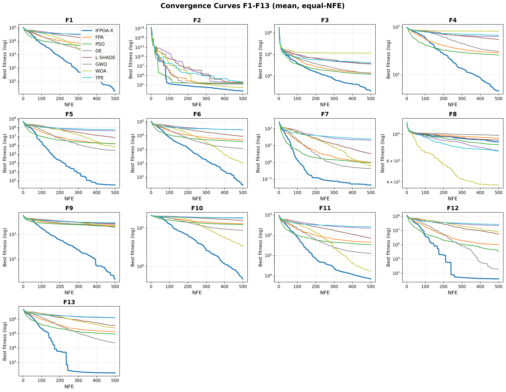
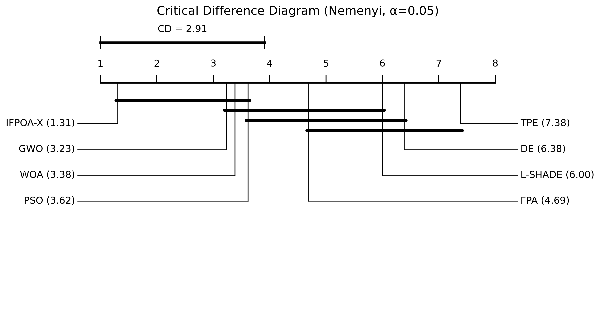
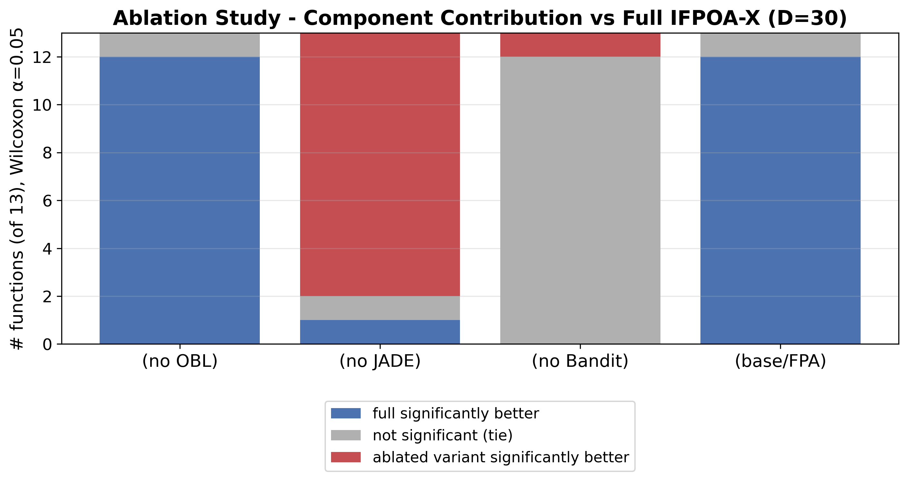
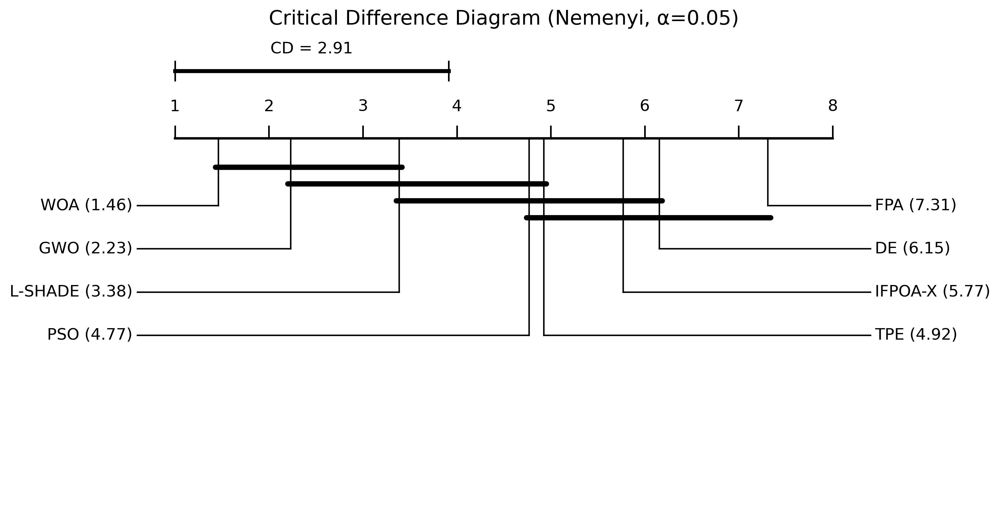
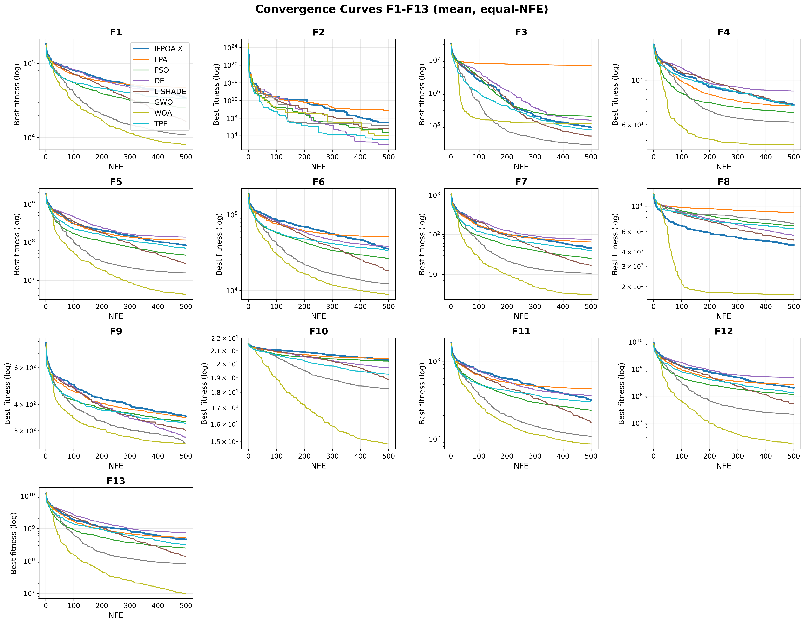
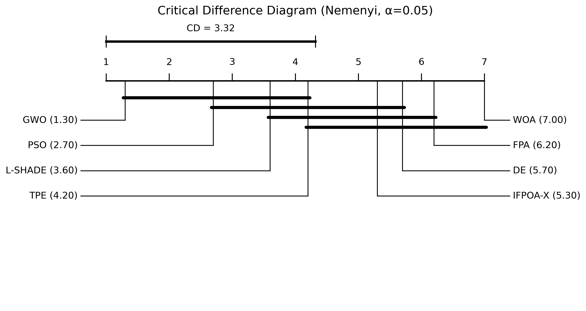
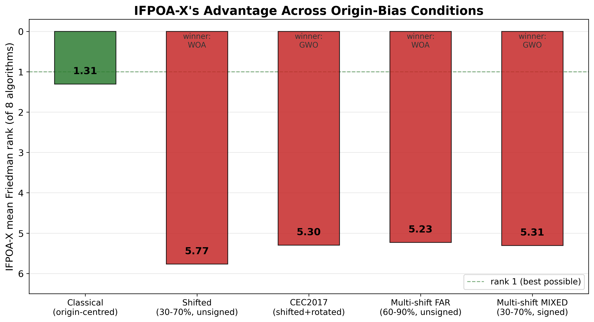
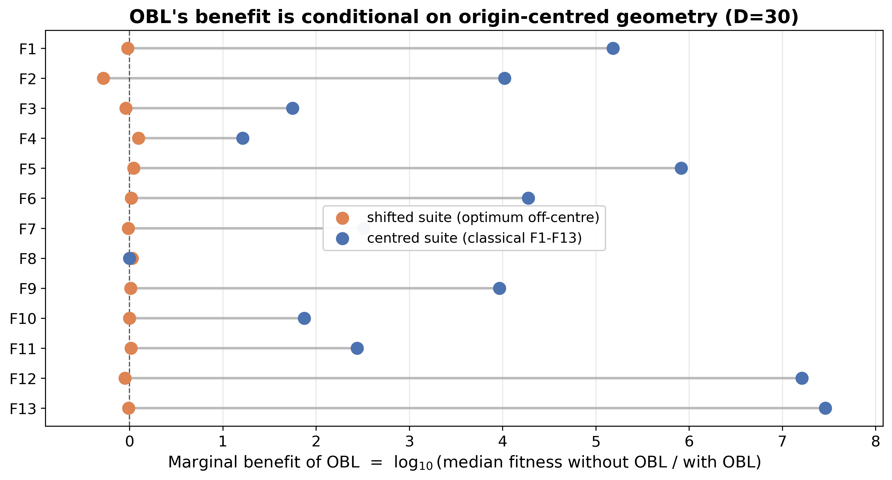

# When Does Opposition-Based Learning Actually Help? An Origin-Bias-Controlled Audit under Tight Evaluation Budgets

**Authors:** Tonny Wahyu Aji,  Marzuki Sinambela, Hapsoro Agung Nugroho, Edward Trihadi

**Affiliation:** STMKG

---

## Abstract

A low-budget performance advantage measured for a metaheuristic under a fair, equal-evaluation protocol may reflect a genuine algorithmic property, or merely an alignment between the algorithm's search mechanism and the geometry of the benchmark suite, a distinction the literature rarely tests. We investigate this using **IFPOA-X**, a hybrid, opposition-based Flower Pollination Algorithm built for the low-budget regime, augmenting FPA with three mechanisms: an Upper Confidence Bound (UCB1) bandit for operator selection, Opposition-Based Learning (OBL), and a JADE-style local search. Against seven baselines (FPA, PSO, DE, L-SHADE, GWO, WOA, and a Bayesian-Optimization baseline, TPE) on the classical F1–F13 suite at D ∈ {30, 50} under a strict 500-evaluation *equal-NFE* protocol over 20 runs, IFPOA-X attains the best mean Friedman rank (**1.31**). A Holm-corrected post-hoc test, however, shows this rank advantage is *not* statistically significant against its two closest baselines, GWO and WOA (both adjusted p = 0.061); even on the classical suite, the apparent superiority over the strongest competitors is not established. A 20-run ablation across all 13 functions shows the advantage that does exist is driven almost entirely by OBL (per-function significant on 12/13), while the bandit is statistically undetectable (12/13 ties) and JADE is *counter-productive* (11/13). Because OBL reflects candidates through the domain centre, where the classical optima cluster, we re-test under **four complementary origin-bias controls** (a custom shift, a 10-function subset of the standard CEC2017 shifted-and-rotated suite, and two further shifts of differing magnitude and sign). The advantage does not survive. IFPOA-X's rank collapses to **5.23–5.77 (5th–6th of 8)** under *every* control, agreeing to within half a rank position even as different baselines (WOA or GWO) come to lead. A direct 2×2 factorial (OBL on/off × centred/shifted) isolates the mechanism within this implementation: removing OBL costs a median ≈ 4 orders of magnitude on the centred suite but essentially nothing once the optimum is displaced (difference-in-differences significant, paired p = 4.9×10⁻⁴). This is strong causal evidence, for the tested implementation and 500-NFE budget, that the opposition operator's benefit is a *conditional response to origin-centred geometry* rather than a general search improvement. We conclude that the examined algorithm's apparent low-budget advantage is substantially an artifact of benchmark geometry, and argue that any OBL-based low-budget claim should be validated against a shifted control before it is believed.

**Keywords:** opposition-based learning; benchmark validity; origin bias; flower pollination algorithm; metaheuristic optimization; ablation study; low-budget optimization; equal-NFE evaluation protocol.

---

## 1. Introduction

Optimization of complex, nonlinear, and often non-differentiable objective functions is a fundamental challenge in engineering design, machine learning, and scientific computing. When gradient information is unavailable, unreliable, or prohibitively expensive to obtain, derivative-free global optimization becomes essential. Nature-inspired population-based metaheuristics, including Particle Swarm Optimization (PSO) [1], Differential Evolution (DE) [2], and the Flower Pollination Algorithm (FPA) [3], have been widely adopted because they require no gradient information, are conceptually simple, and generalize across problem domains.

Despite their popularity, metaheuristics exhibit two persistent failure modes. First, **premature convergence** on rugged, multimodal landscapes remains a well-documented limitation: FPA in particular is characterized by a *static* Lévy step scale and a *fixed* switching probability between global and local search, and a substantial body of work has proposed chaotic maps [4], dynamic switching, and pollinator-attraction biases [5] specifically to counter its tendency to stagnate in local optima (see §2.1 for a full synthesis). Second, competitive solution quality typically demands a **large number of function evaluations (NFE)**: tens or hundreds of thousands of evaluations are standard practice in the benchmarking literature [6], a requirement that is rarely questioned in algorithm comparisons even though it fundamentally limits practical applicability.

In many real-world scenarios, however, each function evaluation is itself computationally expensive. A single hyperparameter configuration of a deep neural network can require anywhere from tens of minutes to several days of training and validation before its quality is known, and high-fidelity engineering simulations incur comparable cost [7]. Under such conditions only a small evaluation budget is practically affordable, typically on the order of hundreds rather than tens of thousands of evaluations, so **sample efficiency**, not asymptotic convergence at unlimited budget, determines real-world success. Bayesian Optimization, which builds a probabilistic surrogate model of the objective to guide the search, has become a leading approach precisely because it is designed for this sample-efficient, expensive-black-box regime [7]. Surrogate-assisted evolutionary algorithms extend the same principle to population-based search by screening candidates through a cheap meta-model before committing to an expensive true evaluation [8–9]. Multi-fidelity methods such as Hyperband and its asynchronous variant ASHA attack the same problem from a different angle, aggressively early-stopping unpromising configurations using low-fidelity approximations [10–11]. This body of work establishes that the cheap-evaluation, large-budget regime in which most metaheuristics are designed and benchmarked is a poor proxy for the expensive-evaluation, tight-budget regime that governs many real optimization problems.

**Why 500 evaluations.** This paper adopts a deliberately extreme budget of $\mathrm{NFE}_{\max} = 500$ real function evaluations as its evaluation ceiling, roughly **one to two orders of magnitude smaller** than the $10^4$–$10^5$ evaluations conventionally used to benchmark metaheuristics on the very same $F_1$–$F_{13}$ suite [6]. The intent is to *simulate* an expensive-evaluation setting. If a single evaluation is illustratively assumed to cost only ten minutes of compute, already optimistic for training a non-trivial deep-learning model or running a high-fidelity simulation [7–8], a budget of 500 evaluations already totals over 80 continuous compute-hours (more than three days) for a *single* optimization run, and realistic hyperparameter-optimization workloads frequently cost far more per evaluation than that. A budget beyond a few hundred evaluations is therefore often simply unaffordable within the time constraints of an actual research or engineering project. Testing every compared algorithm at exactly this budget removes the option of "winning by brute force" over many evaluations and forces a genuine test of how much solution quality an algorithm can extract per evaluation, which is the property this paper is designed to measure.

Yet FPA and most modern metaheuristics are rarely designed or evaluated under a strict, low-budget, equal-NFE protocol, and few approaches integrate adaptive operator control, opposition-based learning, and surrogate screening within a single framework aimed at sample efficiency (§2 develops this gap in full). Compounding this, the No Free Lunch theorem [12] establishes that no optimizer dominates across all problem classes, so broad, fair benchmarking under a controlled evaluation budget, rather than a handful of favourable cases, is required to draw meaningful conclusions about an algorithm's advantage [13].

A further, more specific question motivates this paper and is rarely asked in the metaheuristics literature: even a low-budget advantage measured under a *fair, equal-NFE* protocol could still be an artifact of the benchmark suite's own geometry rather than a general property of the algorithm. This concern is not speculative: Kudela [14] identifies inadequate benchmark design as a central, recognized problem for evolutionary-computation methodology, and Walden and Buzdalov [15] show that origin bias specifically can be directly measured with a statistical test, finding it in several published algorithms. Opposition-Based Learning (OBL) is a natural candidate mechanism to probe this with, because it operates by reflecting candidates through the domain centre, a design choice whose effectiveness could plausibly depend on *where* a benchmark's optima happen to sit, independent of an algorithm's actual search quality. This paper therefore asks, and answers with a controlled experiment (§5.7) rather than speculation: **when does OBL actually help, and is a measured low-budget advantage attributable to the algorithm or to alignment with benchmark geometry?**

To investigate this, we build and study **IFPOA-X**, a hybrid Flower Pollination Algorithm for global optimization under a strict budget of roughly 500 real function evaluations. We are explicit that IFPOA-X is not offered as a recommended best-in-class optimizer; its own ablation (§5.4) shows that one of its components is counter-productive at this budget. Instead, we treat it as a concrete, representative *experimental vehicle* for the audit above: a hybrid that combines an opposition operator with the adaptive machinery common to modern metaheuristics, on which the question of geometry-dependence can be posed sharply. IFPOA-X augments standard FPA with four mechanisms, whose *individual* contributions under this tight budget are measured directly rather than assumed (§5.4):

1. A **UCB1 multi-armed bandit** [16] for adaptive operator selection, which dynamically allocates search effort between global and local operators based on observed reward;
2. **Opposition-Based Learning** [17] to broaden population coverage and escape local optima;
3. A **JADE-style** [18] current-to-*p*best/1 local search with fixed (non-adaptive) $F$/$CR$ and an external archive of displaced solutions, replacing FPA's uniform random local walk; and
4. An optional **k-NN surrogate screen combined with ASHA-style multi-fidelity pruning** [10–11] to avoid wasting expensive evaluations on unpromising candidates (part of the general IFPOA-X framework; disabled in the analytical benchmark of this paper, see §3.4).

IFPOA-X is evaluated against seven baselines, FPA [3], PSO [1], DE [2], L-SHADE [19], GWO [20], WOA [21], and TPE [22] (a Bayesian-Optimization baseline), on the classical $F_1$–$F_{13}$ suite [6] at dimensions $D \in \{30, 50\}$ under a strict equal-NFE protocol.

**Contributions.** The four contributions below build toward the last one, which we consider the paper's primary contribution and the direct answer to the question posed above.

* The **IFPOA-X algorithm**, which combines bandit-based adaptive operator selection, opposition-based learning, and a JADE-style local search on an FPA backbone (with an optional surrogate/ASHA screen for the expensive- evaluation regime that is *not* exercised in this paper, see §3.4).
* A **rigorous equal-NFE benchmark** comparing IFPOA-X against classical (FPA, PSO, DE), modern (L-SHADE, GWO, WOA), and Bayesian-Optimization (TPE) baselines under a deliberately tight budget of ~500 evaluations, with a full Mann–Whitney U + Friedman + Nemenyi Critical-Difference [23] statistical treatment.
* A **component ablation that reports a negative-and-instructive result**: at ~500 evaluations the measured advantage comes almost entirely from OBL, while the UCB1 bandit contributes nothing statistically detectable and the JADE-style local search is *counter-productive*. We frame this as a general cautionary finding for the field: adaptive operator-control mechanisms validated at conventional budgets can fail to pay off, or actively hurt, when transplanted into the ultra-low-budget regime. We report it directly rather than hide it behind the aggregate ranking.
* An **origin-bias control experiment** (§5.7), motivated directly by the ablation finding above: since OBL is both the dominant contributor and a centre-reflection mechanism, we constructed a shifted variant of F1–F13 with every optimum displaced away from the domain centre and re-ran the full equal-NFE protocol. IFPOA-X's rank-1 advantage **does not survive** this control (falling to 6th of 8 algorithms), which we report as the paper's central finding: it demonstrates, with the same statistical rigor used to establish the original advantage, that the advantage is substantially suite-geometry-dependent rather than general-purpose. We believe this validity check should become standard practice for OBL-based metaheuristics, most of which are validated only on origin-centred suites.

The remainder of this paper is organized as follows. Section 2 reviews related work; Section 3 details the IFPOA-X algorithm; Section 4 presents the experimental setup; Section 5 reports results and discussion; Section 6 concludes.

---

## 2. Related Work

### 2.1 The Flower Pollination Algorithm and its variants

The Flower Pollination Algorithm (FPA), introduced by Yang [3], idealizes biotic cross-pollination as global search via Lévy flights and abiotic self-pollination as local search, switching between the two with a fixed probability *p*; on classical test functions it was reported to converge faster than genetic algorithms and particle swarm optimization, and its convergence to the optimal set was later established through a discrete-time Markov-chain analysis [24]. Its structural simplicity and small parameter count made it a popular base for improvement, but the same body of work repeatedly exposes three recurring weaknesses: premature convergence and entrapment in local optima, a *static* Lévy step scaling that is too small for fast progress yet too large to refine, and a *fixed* switch probability that cannot rebalance exploration and exploitation as search proceeds. Variants target these directly. Arora and Anand [4] inject chaotic maps wherever the canonical FPA draws a random number, improving convergence rate and local-optima avoidance, though at the cost of map-selection sensitivity. Kamboh et al. [25] replace the constant *p* with a *dynamic switch probability* and add a swap operator for population diversity, outperforming the standard FPA and several nature-inspired peers, but only on low-dimensional benchmarks. Kopciewicz and Łukasik [26] strip FPA down to a purely biotic "flower-constancy" variant (BFPA) that beats the original on CEC'17, while Mergos and Yang [5] add a pollinator-attraction bias that yields statistically significant gains on CEC'13. Each, however, improves one mechanism in isolation rather than addressing the joint failure of step size and switching. A complementary tuning study by the same authors [27] shows the "best" FPA parameters depend strongly on the objective, the dimension, and the affordable budget, which both motivates adaptive control and warns that hand-tuned FPA variants generalize poorly. Across this literature the evaluation budgets are large and the control of operators remains largely hand-designed, leaving open how FPA should behave when function evaluations are scarce.

### 2.2 Exploration–exploitation enhancement mechanisms

Three lines of work supply the mechanisms IFPOA-X hybridizes. First, Opposition-Based Learning (OBL), introduced by Tizhoosh [17], evaluates a candidate together with its opposite and keeps the better, accelerating convergence by improving the expected quality of sampled points; it has since been embedded in numerous metaheuristics as an initialization and generation-jumping accelerator, its main limitation being that naïve opposition can waste evaluations once the population has already localized. Recent comparative work reinforces that this limitation is not incidental: Lakbichi et al. [28] classify OBL into nine distinct techniques and report that its benefit is variant- and problem-dependent, capable of misleading the search or proving inefficient specifically on symmetric landscapes, precisely the geometry-dependence this paper investigates in IFPOA-X. Variants that relocate the reflection point away from the fixed domain centre have been proposed to address this: Si et al. [29] introduce partial-centroid opposition, reflecting through a population-derived centroid rather than the static domain midpoint, which we return to in §6 as a concrete direction for reducing origin dependence. Second, adaptive Differential Evolution provides the template for success-history control: JADE [18] adapts mutation and crossover parameters online using an optional archive of recently successful solutions, and L-SHADE [19] extends this success-history adaptation with linear population-size reduction, remaining one of the strongest DE variants on the CEC benchmarks, though both were designed and validated under generous evaluation budgets. Third, adaptive operator selection (AOS) casts the choice among operators as a multi-armed bandit problem. The finite-time analysis of the Upper Confidence Bound (UCB1) policy by Auer et al. [16] gives the logarithmic-regret guarantee that makes bandit control attractive, and DaCosta et al. [30] first brought this into evolutionary computation with a *dynamic* multi-armed bandit that couples UCB with a change-detection test, since the best operator drifts over a run; Fialho et al. [31] systematized and analyzed these bandit-based AOS schemes, showing they dominate probability-matching and adaptive-pursuit rules. Their shared limitation, relevant here, is that bandit-based AOS has been studied mostly on combinatorial or artificial credit-assignment scenarios and under many operator trials, not under the tight evaluation ceilings this paper targets.

### 2.3 Modern population-based baselines

The baselines against which IFPOA-X must be judged are the workhorses of continuous global optimization. Differential Evolution [2] and Particle Swarm Optimization [1] remain the canonical population-based optimizers and, in their adaptive descendants such as L-SHADE [19], continue to top competitive benchmarks; their weakness is a well-documented sensitivity to control parameters that adaptive variants only partially remove. Among the "swarm" successors, the Grey Wolf Optimizer and the Whale Optimization Algorithm are the most cited: GWO [20] models an alpha–beta–delta leadership hierarchy and reports competitive results against PSO, DE, and evolution strategies on 29 functions, while WOA [21] mimics humpback bubble-net encircling and is likewise benchmarked as competitive on classical suites. Both enjoy enormous adoption, yet their standing is contested: a substantial critical literature argues that many such metaphor-named methods add little algorithmic novelty and that their reported superiority often reflects weak baselines or lenient protocols rather than genuine advantage (see §5). For the present study these algorithms matter precisely as *fair* reference points: strong when evaluations are plentiful, but rarely characterized under a strict, low-budget, equal-NFE regime.

### 2.4 Expensive and sample-efficient optimization

When each evaluation is costly, the field turns from raw population dynamics to models that spend evaluations wisely. Surrogate-assisted evolutionary algorithms (SAEAs), surveyed by Jin [8], replace part of the expensive objective with a cheap meta-model and manage the resulting approximation error through infill/model-management strategies; Chugh et al. [9] exemplify the state of the art with a Kriging-assisted, reference-vector-guided algorithm for computationally expensive problems, though Kriging-based SAEAs scale poorly beyond low dimensions and modest objective counts. A parallel thread comes from AutoML: Bayesian Optimization, reviewed by Shahriari et al. [7], places a probabilistic prior over the objective and selects points by an acquisition function, and its tree-structured Parzen estimator instantiation is made practical by the Hyperopt library [22]; BO is highly sample-efficient in low dimensions but its cost grows sharply and its advantage over random search erodes as dimensionality rises. Multi-fidelity and early-stopping methods attack the budget from the other side: Hyperband [10] frames configuration evaluation as a pure-exploration infinite-armed bandit that aggressively early-stops poor candidates, and ASHA [11] makes the underlying successive-halving asynchronous and massively parallel. Both deliver order-of-magnitude speedups but were developed for hyperparameter tuning of learning models rather than for continuous black-box function optimization, and neither integrates opposition or bandit-based operator control. IFPOA-X's *k*-NN surrogate screen plus ASHA-style pruning is a deliberate transplant of these ideas into a metaheuristic operating at roughly 500 real evaluations, a regime the SAEA and AutoML literatures rarely study together.

### 2.5 Benchmarking and fair-comparison practice

Credible claims of sample efficiency depend on the evaluation protocol, and the methodological literature is unambiguous about its requirements. The classical F1–F13 functions originate in the suite of Yao, Liu, and Lin [6], whose scalable unimodal and high-dimensional multimodal functions remain a standard testbed for continuous optimizers. The No Free Lunch theorems of Wolpert and Macready [12] establish that no optimizer can dominate across all problem classes, which reframes the goal from "winning everywhere" to demonstrating a *specific*, well-characterized advantage under a stated regime: here, tight budgets. On the statistical side, Derrac et al. [23] provide the now-standard non-parametric methodology for comparing evolutionary and swarm algorithms: Wilcoxon rank-based tests for pairwise comparison, and Friedman ranking with post-hoc procedures (including Nemenyi critical-difference analysis) for multiple comparisons. This non-parametric family is the basis for the protocol adopted in this paper (with the specific per-function, ablation, and cross-function test choices detailed in §4.5). Finally, the critical survey by Sörensen [13] warns that a "tsunami" of metaphor-based methods has eroded rigor, with claimed superiority frequently traceable to unequal budgets, weak baselines, or omitted statistics. Collectively, this literature defines the equal-NFE, statistically controlled protocol that a sample-efficiency claim must satisfy to be believed. This critique remains active in the recent literature rather than settled: Velasco et al. [32] analyze 111 recent "new," "hybrid," or "improved" metaheuristic papers and find benchmarking and novelty-claim concerns still largely unresolved, and Vermetten et al. [33] show, from a large-scale benchmarking of metaphor-based heuristics on the BBOB suite, that conclusions about a method's competitiveness can depend materially on the evaluation budget and performance measure chosen, the same protocol-sensitivity this paper's equal-NFE design is intended to control for. On the geometry side specifically, Mohamed et al. [34] evaluate metaheuristics on CEC-2021 problems explicitly parameterized by bias, shift, and rotation, illustrating that shifted/rotated instances are a standard, community-accepted validity tool rather than a construction specific to this paper (§5.7.2).

### 2.6 Research gap

Synthesizing these threads reveals the gap this paper actually addresses, a gap in *evaluation practice* rather than in algorithm design. Opposition-based mechanisms are widely reported to accelerate convergence and improve solution quality [17], but that evidence is overwhelmingly gathered on the classical, origin-centred test suites (F1–F13 and their close relatives) whose optima sit at or near the domain centre. Because opposition reflects candidates through that same centre (§3.2), its benefit is geometrically entangled with the placement of the optima, yet the OBL literature rarely isolates the interaction between the opposition operator and benchmark-centre geometry: opposite-of-elite quality on a centrally symmetric landscape and genuine opposition-driven exploration are seldom told apart, and results on origin-shifted or rotated instances are the exception rather than the rule. A parallel weakness compounds this: the strongest modern baselines (DE, L-SHADE, GWO, WOA) are characterized mainly at generous budgets, and, as the fair-comparison literature stresses [12–13], a reported low-budget advantage that is never tested under a controlled evaluation budget and a geometry control cannot be distinguished from a benchmark artifact. This is not unique to opposition: Vermetten et al. [35] show with their BIAS toolbox that many population-based algorithms display measurable structural bias toward the centre of the objective space, and Rajwar and Deep [36] survey structural bias across metaheuristics more broadly, arguing detection methodology remains fragmented. OBL's centre-reflection operator is thus one concrete, mechanistically transparent instance of a bias pattern already known to affect the field at large, which is what motivates treating IFPOA-X's collapse (§5.7) as informative for that broader literature rather than as an isolated anomaly. The specific, unfilled gap is therefore:

> existing opposition-based studies commonly report low-budget gains on unshifted suites, but rarely isolate the interaction between the opposition operator and benchmark-centre geometry under a strict equal-NFE protocol with a full nonparametric analysis.

We close this gap not by proposing a better algorithm but by building one opposition-based hybrid (IFPOA-X), measuring which of its components actually drive any advantage under a 500-evaluation budget, and then subjecting that advantage to four origin-bias controls. Table 1 positions this study against representative prior work along the axes that matter for the gap above.

**Table 1. Positioning against representative prior work.** (✓ = addressed; ✗ = not; —  = not applicable.)

| Study | Host algorithm | OBL type | Tested on centred suite | Shifted/rotated control | Tight NFE (≤10³) | Component ablation |
|---|---|---|---|---|---|---|
| Tizhoosh [17] | generic | elite/basic | ✓ | ✗ | ✗ | ✗ |
| Arora & Anand [4] | FPA + chaos | — | ✓ | ✗ | ✗ | ✗ |
| Kopciewicz & Łukasik [26] | FPA (BFPA) | — | ✓ (CEC'17) | partial | ✗ | ✗ |
| Mergos & Yang [5] | FPA | — | ✓ (CEC'13) | partial | ✗ | ✗ |
| Zhang & Sanderson [18] (JADE) | DE | — | ✓ | ✗ | ✗ | ✗ |
| **This work** | **FPA + OBL + UCB1 + JADE** | **elite-opposition** | **✓** | **✓ (4 controls)** | **✓ (500)** | **✓ (20×13, paired)** |

---

---

## 3. Proposed Method: IFPOA-X

IFPOA-X extends the standard FPA [3] by replacing its static, stochastic search policy with three adaptive mechanisms evaluated in this paper: (i) bandit-based operator selection (§3.1), (ii) Opposition-Based Learning (§3.2), and (iii) a JADE-style local search (§3.3). Concretely, IFPOA-X retains FPA's Lévy-flight global-pollination operator as its global move but **replaces FPA's local self-pollination operator entirely** with the JADE-style operator of §3.3, and replaces FPA's fixed switch probability with the UCB1 selector of §3.1; it is therefore best understood as an **FPA-backbone hybrid** used here as an experimental vehicle, not a minimal FPA variant. A fourth component of the broader framework, an optional surrogate/multi-fidelity screen, is **disabled throughout this paper** and, since it contributes nothing to any result reported here, is summarized in a single line in §3.4 rather than detailed. Each candidate solution is represented in a normalized unit hypercube $u \in [0,1]^D$ and mapped to the true parameter space by the search-space transform of the underlying problem; all equations below are given in this single-objective unit space.

### 3.1 Adaptive operator selection (UCB1 bandit) and step-size self-calibration

At each iteration, IFPOA-X must choose between two competing search operators: a **global** operator (Lévy-flight pollination, §3.1.1) and a **local** operator (JADE-style mutation, §3.3). Rather than a fixed switching probability as in standard FPA, IFPOA-X frames this choice as a two-armed bandit problem and selects the arm $a \in \{\text{global}, \text{local}\}$ that maximizes the UCB1 index [16]:
$$
a_t = \arg\max_{a \in \{\text{global},\,\text{local}\}} \; \bar{R}_a + c \sqrt{\frac{\ln(N_{\text{global}}+N_{\text{local}}+1)}{N_a}}
$$
where $\bar{R}_a$ is the running mean reward of arm $a$, $N_a$ is the number of times $a$ has been selected, and $c = 1.4$ (`bandit_c`) is the exploration constant; ties are broken in favour of the less-selected arm. The selector is invoked **once per generated child** within a steady-state loop (not once per generation); at a 500-evaluation budget this yields on the order of a few hundred operator decisions per run, a fact that matters for interpreting the ablation in §5.4. For the single-objective problems studied here, the arm's **reward** is the clipped, normalized improvement of the best-so-far value produced by the resulting evaluation,
$$
r = \operatorname{clip}\!\left(\frac{f^{\ast}_{\text{before}} - f^{\ast}_{\text{after}}}{A_{\text{ref}}},\; 0,\; 1\right),
$$
where $f^{\ast}$ denotes the best objective value found so far and $A_{\text{ref}}$ is a normalizing scale set to the current best–worst objective spread plus a 5% margin, so that $r \in [0,1]$ as UCB1's bounded-reward assumption requires. (In the framework's general multi-objective mode this quantity is a hypervolume gain; on a single objective it reduces exactly to the improvement above, which is the only form used in this paper.)

**Step-size self-calibration.** The global (Lévy) step is scaled by a factor $c_t$ that combines deterministic annealing with the classical **one-fifth success rule** of evolution-strategy step-size control: increase the step scale when the recent acceptance rate exceeds a target, and decrease it otherwise. This is instantiated as follows:
$$
a_t^{\text{anneal}} = \left(1 - \min\!\left(1, \tfrac{t}{T}\right)\right)^{\eta}, \qquad \eta = 1.5 \; (\texttt{eta\_anneal}),
$$
$$
c_t = \operatorname{clip}\big(c_0 \cdot a_t^{\text{anneal}},\; c_{\min},\, c_{\max}\big), \quad c_{\min}=0.01,\; c_{\max}=0.5,
$$
with $c_0$ itself adapted every iteration from the acceptance ratio $\rho$ over the last 20 attempts against a target rate $\rho^\ast = 0.20$:
$$
c_0 \leftarrow \begin{cases} \min(c_0 \cdot 1.15,\; c_{\max}) & \rho > \rho^\ast \\ \max(c_0 \cdot 0.85,\; c_{\min}) & \rho < \rho^\ast \end{cases}
$$

#### 3.1.1 Global operator: Lévy-flight pollination
When the bandit selects the global arm, a child is generated by a Lévy step
drawn via the Mantegna algorithm with stability index $\beta = 1.5$
(`levy_beta`), following the Lévy-flight formulation used in the original
FPA [3]:
$$
u^{\text{child}} = \operatorname{clip}\big(u^{\text{parent}} + c_t \cdot L(\beta),\; 0,\, 1\big),
$$
where $L(\beta)$ is the Mantegna-generated Lévy step vector.

### 3.2 Opposition-Based Learning (OBL)

To broaden population coverage independently of the bandit/JADE search, IFPOA-X periodically injects an **opposite** candidate following Tizhoosh's OBL scheme [17]. In the normalized unit space $[0,1]^D$ the opposite of $u$ is
$$
u^{\circ} = \mathbf{1} - u,
$$
which in the original search space with per-coordinate bounds $[a_j, b_j]$ is a reflection through the domain centre, $x_j^{\circ} = a_j + b_j - x_j$. OBL is triggered every `obl_frequency` $=3$ evaluations; when triggered, one elite $u_{\text{elite}}$ is drawn at random from the top `obl_top_k` $=3$ solutions by objective value, its opposite $u^{\circ}_{\text{elite}}$ is evaluated (consuming exactly one real evaluation), and it replaces the current worst individual if it is at least as good. This bounds OBL's cost to one evaluation per trigger, preserving the equal-NFE accounting used throughout the paper.

**Geometric note (central to this paper).** Reflection through the domain centre does *not* move a candidate closer to that centre: $u$ and its opposite $u^{\circ}$ are equidistant from the midpoint $\tfrac{1}{2}\mathbf{1}$. The value of OBL therefore depends entirely on the landscape's geometry relative to the domain centre, not on any intrinsic "pull" toward it. On a centrally symmetric function over symmetric bounds, as most of the classical F1–F13 suite is, with $f(x)=f(-x)$ about the centre, the opposite of an elite has (near-)identical fitness at a mirror location. In this regime OBL acts less as a mechanism for *discovering* better points than as **fitness-preserving elite replication**: it cheaply adds further high-quality individuals to the cohort and accelerates the eviction of inferior ones. Distinguishing genuine opposition-driven discovery from this replication effect, and pinning down its dependence on where a benchmark places its optima, is precisely what the origin-bias controls of §5.7 are designed to probe: displacing the optima off-centre removes the symmetry that makes the opposite of an elite a high-quality point in the first place. Framed in terms of algorithmic invariance, translation invariance (insensitivity of an algorithm's performance to where the objective's optimum sits in space) is recognized as a property critical to reliable performance [37]; the analysis above and the results in §5.7 amount to showing that IFPOA-X, specifically via OBL, lacks this property.

### 3.3 JADE-style local search

When the bandit selects the local arm, IFPOA-X applies a **current-to-pbest/1** mutation with an external archive of displaced solutions, following the mutation structure of JADE [18]:
$$
u^{\text{child}}_j = \begin{cases}
u^{\text{parent}}_j + F\,(u^{\text{pbest}}_j - u^{\text{parent}}_j) + F\,(u^{r_1}_j - u^{r_2}_j) & \text{if } \mathrm{rand}<CR \text{ or } j=j_{\text{rand}} \\
u^{\text{parent}}_j & \text{otherwise}
\end{cases}
$$
clipped to $[0,1]$ after each coordinate update. Unlike full JADE, the mutation and crossover factors are drawn per-iteration from **fixed** distributions, $F \sim \mathrm{Cauchy}(\mu_F{=}0.5,\, 0.1)$ and $CR \sim \mathcal{N}(\mu_{CR}{=}0.5,\, 0.1)$, both clipped to $[0,1]$ (`jade_fmean`, `jade_cmean`); the success-history adaptation of $\mu_F$ and $\mu_{CR}$ that defines full JADE is **not** enabled in this instantiation, which is why we describe the operator as *JADE-style* rather than as a complete JADE implementation. The "p-best" vector $u^{\text{pbest}}$ is sampled from the top `jade_p` $=20\%$ of the current archive (in the single-objective setting used here the two internal objectives coincide, so the non-dominated "front" is degenerate and this reduces to a random 20% subset of the archive; if the archive is empty, the best population member is used). The difference vectors $u^{r_1}, u^{r_2}$ are sampled without replacement from the union of the current population and an **external archive** of up to `jade_arch_max` $=128$ previously displaced solutions, exactly as in standard JADE.

### 3.4 Optional surrogate screen and multi-fidelity pruning (disabled in this study)

The broader IFPOA-X framework additionally supports a $k$-nearest-neighbour surrogate that screens out unpromising candidates before they consume a real evaluation, and an ASHA-style [11] multi-fidelity rung schedule that evaluates candidates at increasing fidelity across successive rungs. Both are intended to amortize the cost of genuinely expensive real-world evaluations (e.g., neural-network training) [8, 10–11]. **Neither is active anywhere in this paper**: because the $F_1$–$F_{13}$ functions are analytically cheap to evaluate, the benchmark protocol (§4) runs with the surrogate disabled (`use_knn_screen = False`) and a single trivial fidelity rung, so that every compared algorithm consumes exactly the same number of real evaluations without confounding from screening or promotion policies. This is a deliberate scoping decision, reiterated in §5.6, not an oversight: this paper's contribution is the origin-bias audit of the tested mechanisms (§3.1–§3.3), not a demonstration of the surrogate/multi-fidelity components.

### 3.5 Implementation details (complexity and pseudocode)

The per-iteration computational complexity and the full pseudocode (Algorithm S1) are given in the Supplementary Material; the per-iteration overhead beyond the objective evaluation is (D + |\mathcal{A}|\log|\mathcal{A}|)$, negligible relative to one real evaluation in the expensive-optimization regime this paper targets.

---

## 4. Experimental Setup

### 4.1 Benchmark functions
We use the classical scalable suite F1–F13 of Yao *et al.* [6]: unimodal
functions F1–F7 (Sphere, Schwefel 2.22, Schwefel 1.2, Schwefel 2.21, Rosenbrock,
Step, Quartic+noise) that test exploitation, and multimodal functions F8–F13
(Schwefel 2.26, Rastrigin, Ackley, Griewank, Penalized 1, Penalized 2) that test
exploration. All functions are minimized with global minimum f(x\*) = 0 (F8 is
offset so its minimum is 0). Domains are listed in Table 2.

**Table 2. Suite benchmark F1–F13.**

| ID | Nama | Domain | Modalitas |
|---|---|---|---|
| F1 | Sphere | [−100, 100]ᴰ | unimodal |
| F2 | Schwefel 2.22 | [−10, 10]ᴰ | unimodal |
| F3 | Schwefel 1.2 | [−100, 100]ᴰ | unimodal |
| F4 | Schwefel 2.21 | [−100, 100]ᴰ | unimodal |
| F5 | Rosenbrock | [−30, 30]ᴰ | unimodal |
| F6 | Step | [−100, 100]ᴰ | unimodal |
| F7 | Quartic + noise | [−1.28, 1.28]ᴰ | unimodal (noise) |
| F8 | Schwefel 2.26 | [−500, 500]ᴰ | multimodal |
| F9 | Rastrigin | [−5.12, 5.12]ᴰ | multimodal |
| F10 | Ackley | [−32, 32]ᴰ | multimodal |
| F11 | Griewank | [−600, 600]ᴰ | multimodal |
| F12 | Penalized 1 | [−50, 50]ᴰ | multimodal |
| F13 | Penalized 2 | [−50, 50]ᴰ | multimodal |

### 4.2 Compared algorithms
The proposed **IFPOA-X** is compared against seven baselines: FPA [3] and
PSO [1] (classical); DE [2], L-SHADE [19], GWO [20], and WOA [21] (modern); and
TPE, a Tree-structured Parzen Estimator [22] used as a Bayesian-Optimization
baseline. IFPOA-X, FPA, and PSO use the authors' implementation; DE, L-SHADE,
GWO, and WOA use `mealpy` [38]; TPE uses `optuna` [39].

### 4.3 Equal-NFE fairness protocol
The decisive fairness criterion for metaheuristic comparison is an identical number of *real* objective function evaluations (NFE), not iterations. A single objective wrapper counts every call to the true function for *every* algorithm and enforces a hard cap, stopping each run after exactly NFE_max = 500 real evaluations; any algorithm that overshoots a generation is truncated to the first 500. All convergence curves are therefore on an identical NFE axis. We note the following controls and residual confounds explicitly, as they matter at a 500-evaluation budget.

*Caching.* IFPOA-X memoizes evaluations keyed on the exact continuous point; on the continuous $F_1$–$F_{13}$ (and CEC2017) domains an exact repeat essentially never occurs, so caching neither saves IFPOA-X evaluations nor affects the count in practice: the hard cap counts distinct real calls regardless. Caching is therefore not a source of unequal budgeting here (it exists for the framework's discrete hyperparameter-optimization use case).

*Initialization and boundary handling.* IFPOA-X, FPA, and PSO run through the same harness and share Latin-Hypercube initialization and clip-to-bound repair; the `mealpy` baselines (DE, L-SHADE, GWO, WOA) use that library's default uniform-random initialization and boundary handling, and TPE uses `optuna`'s sampler. We did *not* force a common initial population across the two families, so a small initialization advantage for the harness algorithms cannot be excluded at this tight budget. This is a genuine limitation (revisited in §5.6), but it does not affect the paper's central finding, which concerns how IFPOA-X's *own* advantage changes across benchmark geometries (§5.7), a within-algorithm comparison that any fixed initialization scheme affects identically on both sides.

*Noise (F7).* F7 adds uniform noise to each evaluation; the noise is drawn from the shared objective RNG, so all algorithms competing on F7 face draws from the same distribution.

*TPE.* TPE is a sequential model-based (Bayesian) optimizer, not population-based; the "population size 24" convention below does not apply to it. Its `optuna` setting `n_ei_candidates = 24` is the number of expected-improvement candidate points sampled per trial, not a population size.

*Software.* Experiments used Python 3.11 with `mealpy` 3.0.x, `optuna` 3.x, `opfunu` 1.0.x, NumPy 1.26, and SciPy 1.16; exact pinned versions ship with the reproducibility repository.

**AI-assisted research workflow.** During software development and analysis, the authors used ChatGPT 5.5 Thinking (OpenAI) and Claude Opus 4.8 (Anthropic) as assistive tools for code suggestions, debugging, checking statistical-analysis workflows, and developing data-visualisation scripts. These tools were not used to generate, fabricate, or modify experimental data, select favourable results, or make autonomous scientific decisions. All AI-assisted code and analytical suggestions were manually reviewed, tested, and validated by the authors against the source code, raw experimental CSV files, independently recomputed statistical outputs, and the relevant primary literature. The experimental design, execution, interpretation, and final reporting decisions remained entirely under the authors’ responsibility.

### 4.4 Parameter settings

Dimensions D ∈ {30, 50}; population size 24 for every population-based algorithm (TPE, being sequential model-based, has no population; see §4.3); and **20 independent runs** with fixed, reproducible seeds ($\mathrm{seed} = 1000 \times \mathrm{run\_id}$).

**Budget rationale (NFE_max = 500).** As motivated in §1, this budget is chosen to be roughly **one to two orders of magnitude smaller** than the $10^4$–$10^5$ evaluations conventionally used to benchmark metaheuristics on the very same $F_1$–$F_{13}$ suite [6]. This is a deliberate stress test: it simulates the *expensive-evaluation* regime of real applications such as hyperparameter optimization of deep neural networks, where a single evaluation (one full training-and-validation run) can cost from tens of minutes to several days [7–8], in which only a small number of evaluations is practically affordable. Enforcing the identical, tight budget on every compared algorithm (via the equal-NFE protocol of §4.3) removes the option of "winning through brute-force many-evaluation convergence" and isolates the property under test: how much solution quality each algorithm can extract per unit of (expensive) evaluation.

**Baseline honesty.** No algorithm-specific hyperparameter tuning was performed for any baseline, in either direction. FPA and PSO use the values already fixed in the authors' own implementation (unrelated to this paper); DE, L-SHADE, GWO, and WOA use the **default hyperparameters shipped in `mealpy`** [38], with only population size and the evaluation-budget termination criterion configured; TPE uses **default `optuna` `TPESampler`** [39] settings, with only the random seed set. Using each library's published defaults avoids selective post-hoc tuning of individual baselines. It does not, however, eliminate the possibility that algorithm-specific calibration would improve their performance, nor does it make the comparison perfectly symmetric: IFPOA-X's own constants reflect design effort during its development that the untuned baselines did not receive. The comparison should therefore be read as *out-of-the-box baselines against a purpose-built hybrid under a fixed budget*, and the reported margins interpreted with that asymmetry in mind (revisited in §5.6). Supplementary Table S1 reports every parameter value used.

### 4.5 Performance metrics and statistical tests
For each (algorithm, function) pair we report the best, worst, mean, standard deviation, and median of the final fitness over 20 runs. We apply a single statistical-analysis plan, identical across every suite in this paper (classical, shifted, CEC2017, and the multi-shift controls), and we distinguish two units of analysis explicitly.

*Per-function* significance uses the **Mann–Whitney U** (Wilcoxon rank-sum) test on the 20 runs of a single function (IFPOA-X vs. each baseline, α = 0.05). We use an independent-samples test here because the baselines are run under their own libraries' initialization and random-number streams and are therefore not matched to IFPOA-X on a per-run basis; a paired test would misrepresent the design. (The within-IFPOA-X ablation and the OBL×geometry factorial of §5.4 and §5.7.5 *are* matched by construction — every variant shares IFPOA-X's harness, seed, and Latin-Hypercube initial population — and there we use the paired Wilcoxon signed-rank test.) F7's additive noise is not matched across algorithms, and its per-function result is read with that caveat. *Cross-function* (suite-level) significance uses the Friedman omnibus test with the Iman–Davenport correction and Kendall's $W$ as the omnibus effect size; when the omnibus null is rejected, we run a post-hoc comparison with IFPOA-X as control, reporting Holm-adjusted $p$-values as the primary result and Finner-adjusted values as a sensitivity check, and we visualize the outcome with a Nemenyi Critical-Difference diagram. Because metaheuristic results are typically skewed and heavy-tailed, we report the non-parametric Vargha–Delaney $A_{12}$ as the primary effect size (Cohen's $d$ is given in the supplementary tables for reference only), and 95% bootstrap confidence intervals (5000 resamples over functions) for the mean ranks. This methodology follows the nonparametric-comparison guidance of Derrac et al. [23]. A per-function or per-suite $p$-value is never interpreted as evidence of global superiority; suite-level conclusions rest only on the cross-function tests.

---

## 5. Results and Discussion

### 5.1 Overall comparison and statistical ranking
We separate two distinct units of analysis throughout: *per-function* tests (20 paired runs on a single function) and *cross-function* tests (the 13 per-function medians treated as the sample). Conflating them is a common source of over-claiming, and the distinction turns out to matter here.

**Per-function.** Table 3 reports mean final fitness per (function, algorithm) at D = 30. IFPOA-X attains the best mean value on **12 of the 13 functions**. The sole exception is F8 (Schwefel 2.26), whose optimum lies far from the origin, on which WOA is best. The per-function Vargha–Delaney effect size favours IFPOA-X against every baseline (mean $A_{12}$ = 0.88–0.99; full table in the supplementary material), which on its own looks like uniform dominance.

**Table 3. Summary statistics of final fitness (mean, D=30, 500 NFE, 20 runs). Best in bold.**

| Func | IFPOA-X | FPA | PSO | DE | L-SHADE | GWO | WOA | TPE |
|---|---|---|---|---|---|---|---|---|
| F1 | **1.81e+00** | 4.79e+03 | 3.62e+03 | 2.44e+04 | 7.77e+03 | 1.28e+03 | 7.41e+01 | 2.86e+04 |
| F2 | **1.18e-01** | 3.47e+01 | 3.17e+01 | 6.98e+01 | 5.61e+01 | 1.70e+01 | 1.36e+00 | 8.72e+01 |
| F3 | **2.05e+03** | 1.38e+04 | 1.22e+04 | 3.58e+04 | 3.73e+04 | 1.35e+04 | 1.16e+05 | 4.21e+04 |
| F4 | **4.58e+00** | 2.90e+01 | 2.59e+01 | 6.34e+01 | 5.44e+01 | 3.07e+01 | 8.21e+01 | 6.63e+01 |
| F5 | **3.13e+01** | 1.52e+06 | 1.45e+06 | 4.28e+07 | 6.49e+06 | 2.53e+05 | 6.60e+05 | 5.81e+07 |
| F6 | **2.70e+00** | 4.94e+03 | 3.67e+03 | 2.62e+04 | 8.71e+03 | 1.19e+03 | 1.04e+02 | 2.54e+04 |
| F7 | **4.51e-02** | 9.93e-01 | 9.35e-01 | 2.04e+01 | 3.24e+00 | 4.25e-01 | 5.99e-01 | 2.38e+01 |
| F8 | 8.65e+03 | 9.25e+03 | 8.19e+03 | 7.26e+03 | 8.96e+03 | 9.78e+03 | **3.78e+03** | 7.24e+03 |
| F9 | **1.60e+00** | 2.27e+02 | 2.04e+02 | 2.52e+02 | 2.70e+02 | 1.92e+02 | 2.10e+02 | 2.88e+02 |
| F10 | **4.67e-01** | 1.29e+01 | 1.22e+01 | 1.80e+01 | 1.54e+01 | 8.70e+00 | 3.35e+00 | 1.85e+01 |
| F11 | **6.96e-01** | 4.41e+01 | 3.35e+01 | 2.20e+02 | 7.10e+01 | 1.25e+01 | 1.67e+00 | 2.58e+02 |
| F12 | **1.57e+00** | 1.05e+05 | 1.23e+04 | 5.05e+07 | 2.81e+06 | 3.65e+01 | 6.03e+06 | 7.03e+07 |
| F13 | **3.28e+00** | 1.80e+06 | 7.99e+05 | 1.61e+08 | 1.31e+07 | 5.11e+04 | 6.48e+06 | 1.74e+08 |
| **Mean rank** | **1.31** | 4.69 | 3.62 | 6.38 | 6.00 | 3.23 | 3.38 | 7.38 |

**Cross-function.** The rank-based omnibus tests qualify that reading. IFPOA-X obtains the best mean Friedman rank (**1.31**), and the omnibus null is decisively rejected (Friedman χ² = 60.64, p = 1.1×10⁻¹⁰; Iman–Davenport F = 23.97, p = 1.3×10⁻¹⁷; Kendall's W = 0.67, large concordance). But the Holm-corrected post-hoc comparison against IFPOA-X (control) shows that its rank advantage is statistically established over only five of the seven baselines: FPA, DE, L-SHADE, and TPE (all Holm p < 0.01), and, marginally, PSO (Holm p = 0.049). It is **not** significant against its two closest competitors, **GWO (Holm p = 0.061) and WOA (Holm p = 0.061)**. The Nemenyi Critical-Difference diagram (Figure 2, CD = 2.91) tells the same story: GWO, WOA, and PSO fall inside IFPOA-X's top clique. In other words, even on the classical suite, before any origin-bias control, IFPOA-X's superiority over the strongest baselines is not statistically demonstrable under conservative correction; the large per-function margins do not translate into a significant *cross-function* rank separation from GWO or WOA, given only N = 13 functions.

This is not a weakness to hide. It is the first hinge of the paper's argument: the two baselines from which IFPOA-X cannot be statistically separated here, GWO and WOA, are precisely the ones that overtake it once the origin bias is removed (§5.7). The same ranking pattern holds at D = 50 (IFPOA-X rank 1.31; Friedman χ² = 61.62, p = 7.2×10⁻¹¹), with GWO/WOA/PSO again inside its top clique (Supplementary Table S2). Full adjusted p-values, bootstrap rank confidence intervals, and effect sizes for both dimensions are in the supplementary material.

A single mean-rank number can hide variability, so Supplementary Figure S1 shows the full per-(function, run) rank distribution at D = 30. IFPOA-X's box collapses to a near-single line at rank 1, with its only excursion to rank 2 corresponding to the F8 exception discussed above, visual confirmation that the advantage is consistent rather than driven by a few outlier functions.

### 5.2 Per-function pairwise significance (Mann–Whitney U)
Supplementary Table S3 summarizes *per-function* wins/losses/ties of IFPOA-X against each baseline (D = 30): for each function, a Mann–Whitney U test over the 20 runs, at α = 0.05. On this per-function basis IFPOA-X wins on at least 12 of the 13 functions against every baseline, its only non-wins occurring on F8 (a loss against DE, WOA, and TPE, and a statistical tie against PSO). We stress that these are per-function outcomes and must not be read as a global claim of significant superiority: as §5.1 showed, the *cross-function* rank test (the appropriate unit for a suite-level conclusion) cannot separate IFPOA-X from GWO or WOA under Holm correction. The per-function advantage is largest on the multimodal and ill-conditioned functions (F5, F9–F13); §5.4 attributes this specifically to OBL rather than to "adaptive operator selection" in general.

### 5.3 Convergence behaviour
Figure 1 shows the mean convergence curves on an identical NFE axis. IFPOA-X (thick blue) decreases steadily throughout the budget on almost all functions,
whereas the baselines plateau early, a signature of premature convergence. This
sustained improvement is attributable primarily to OBL, which broadens
coverage from the first iterations onward (confirmed by the ablation study,
§5.4); the surrogate screen was disabled for this benchmark (§3.4) and so
plays no role in these curves. The exception is F8, where IFPOA-X's
exploitative bias is disadvantageous.

**Figure 1. Convergence curves F1–F13 (mean, equal-NFE, D=30).**

**Figure 2. Critical Difference diagram (Nemenyi, α = 0.05).**

### 5.4 Ablation study
To isolate the contribution of each mechanism, we ran four ablated variants:
disabling OBL, disabling the JADE-style local search, disabling the UCB1
bandit (falling back to uniform random arm selection), and a "base" variant
with all three disabled (closest to plain FPA). These use the `use_obl`,
`use_jade_local`, and `use_bandit` flags already built into `ifpoax.py`
(§3.1–3.3; no algorithm code was modified for this study). Unlike the pilot
version of this study, the ablation reported here covers **all 13 functions**
with **20 independent runs per (function, variant)**, using the identical
seed scheme (`seed = run_id × 1000`) as the main comparison in §5.1, so every
ablated run is *paired* with its corresponding "full" run — same harness, same
seed, same Latin-Hypercube initial population — which makes a paired Wilcoxon
signed-rank test at each function appropriate here, rather than the unpaired
test a smaller pilot would require. The "full" variant reuses the 20 runs
already reported in Table 3.

**Table 4. Mean final fitness per function × ablation variant (D=30, 500 NFE, 20 paired runs).**

| Func | full | no OBL | no JADE | no Bandit | base (≈FPA) |
|---|---|---|---|---|---|
| F1  | 1.81e+00 | 1.89e+04 | 1.34e-06 | 1.64e+00 | 2.02e+04 |
| F2  | 1.18e-01 | 4.85e+03 | 2.70e-05 | 1.33e-01 | 3.81e+03 |
| F3  | 2.05e+03 | 5.63e+04 | 2.30e+02 | 2.25e+03 | 5.82e+04 |
| F4  | 4.58e+00 | 6.33e+01 | 7.76e-03 | 4.48e+00 | 6.68e+01 |
| F5  | 3.13e+01 | 2.72e+07 | 2.89e+01 | 7.92e+01 | 2.34e+07 |
| F6  | 2.70e+00 | 1.82e+04 | 0.00e+00 | 5.45e+00 | 2.07e+04 |
| F7  | 4.51e-02 | 1.27e+01 | 2.73e-02 | 5.58e-02 | 1.44e+01 |
| F8  | 8.65e+03 | 8.67e+03 | 8.88e+03 | 8.61e+03 | 8.69e+03 |
| F9  | 1.60e+00 | 2.94e+02 | 7.33e-07 | 2.62e-01 | 3.05e+02 |
| F10 | 4.67e-01 | 1.86e+01 | 3.50e-04 | 7.35e-01 | 1.94e+01 |
| F11 | 6.96e-01 | 1.70e+02 | 2.15e-03 | 1.03e+00 | 1.91e+02 |
| F12 | 1.57e+00 | 2.61e+07 | 1.03e+00 | 1.62e+00 | 3.40e+07 |
| F13 | 3.28e+00 | 9.11e+07 | 2.91e+00 | 3.82e+00 | 9.15e+07 |

Because raw magnitudes span up to eight orders of magnitude across functions (dominated by F1/F5/F13), we summarize significance with a per-function paired Wilcoxon signed-rank test (full vs. each ablated variant, α = 0.05) rather than a magnitude-averaged score, which would be dominated by these outliers.

**Figure 3. Component contribution — wins/losses/ties (paired Wilcoxon, α=0.05, 13 functions).**

The full-suite, paired result **confirms the pilot's three findings across all 13 functions with no reversals**. **OBL is unambiguously the dominant contributor**: disabling it degrades performance significantly on **12 of 13 functions** (tying only on F8), by up to four orders of magnitude on F1/F2/F5/F6/F9–F13, and the "base" variant's degradation pattern is nearly identical to "no OBL" alone (also 12/0/1), confirming OBL accounts for essentially all of the gap between IFPOA-X and plain FPA. **The UCB1 bandit's isolated contribution remains statistically undetectable at this budget**: 12 of 13 functions tie, with a single significant loss (F9); disabling it and falling back to uniform 50/50 arm selection changes almost nothing. **The JADE local search's isolated contribution is significantly *negative* on 11 of 13 functions**, with full winning on only 1 function (F8) and tying on 1 (F7): removing JADE improves results, often by several orders of magnitude (F1, F2, F9–F11). Because this JADE-style operator uses fixed (non-adaptive) $F$/$CR$ rather than JADE's success-history adaptation (§3.3), its current-to-*p*best/1 steps — drawn against a degenerate single-objective *p*-best set — perturb the Lévy-flight trajectory that OBL has already begun to steer productively, which is why removing JADE *improves* results rather than merely leaving them unchanged. We flag this as a genuine limitation of the current design under extreme low-budget conditions rather than omit or soften it: the current-to-*p*best/1 move is borrowed from JADE, which was itself proposed and validated at conventional (much larger) evaluation budgets [18], and its benefit under a 500-NFE regime should not be assumed without the kind of direct test performed here.

**Why the adaptive components fail at this budget: a mechanism-level account.** Both failures are consistent with the algorithm's measured behaviour at 500 evaluations, established by direct instrumentation of representative runs. (i) *Bandit.* The operator selector is invoked once per generated child in a steady-state loop (§3.1); instrumentation shows roughly 440–490 such decisions per run, split almost exactly evenly between the global and local arms (for example 230/230 on F1, 243/243 on F8). Despite this many decisions, the two arms receive near-identical and very small reward signals (normalized best-so-far improvements), so their estimated means stay within the UCB1 confidence band and selection remains close to 50/50 — statistically indistinguishable from the uniform 50/50 selector it is compared against, exactly the 12/13 ties observed. The bandit is not broken; its reward signal is too weak and too similar across arms to drive exploitation within the budget. (ii) *JADE-style local search.* This operator uses fixed $F$ and $CR$ distributions rather than JADE's success-history adaptation (§3.3), so there is no adaptation to "warm up"; instead, its current-to-*p*best/1 steps — drawn against a degenerate single-objective *p*-best set — perturb the Lévy-flight trajectory that OBL has already begun to steer productively, which is why removing it *improves* results on 11 of 13 functions rather than merely leaving them unchanged. The lesson is not that these mechanisms have "too few generations" to work; it is that, under a tight budget, an operator-selection reward that cannot separate the arms and a non-adaptive local operator that interferes with the dominant OBL signal earn their keep on neither count — a cautionary point for anyone porting adaptive-operator machinery into the ultra-low-budget regime.

### 5.5 Ranking stability across the two tested dimensions
The classical-suite ranking pattern remains stable between D = 30 and D = 50:
IFPOA-X's mean Friedman rank is **1.31 at both dimensions**, and its per-function
win profile is virtually identical (at least 12 of 13 functions against every
baseline). The relative ordering of the field is also stable, with WOA/GWO/PSO
forming the second tier and TPE consistently last under the 500-NFE budget. We
do not test beyond D = 50, and the origin-bias controls (§5.7) were not run at
D = 50, so this is a statement of ranking stability across the two tested
dimensions on the centred suite rather than a general scalability claim (see
§5.6).

### 5.6 Discussion and limitations

**Untuned baselines (already established, §4.4).** DE, L-SHADE, GWO, and WOA were run with their default `mealpy` hyperparameters, and TPE with default `optuna` settings; none were tuned for this benchmark (§4.4). This avoids biasing the comparison through selective baseline tuning, but it is a genuine limitation: DE and L-SHADE in particular are known to be sensitive to $F$/$CR$ settings, and a problem-specific tuning pass could narrow the gap to IFPOA-X on some functions. The reported advantage should therefore be read as "IFPOA-X out-of-the-box vs. baselines out-of-the-box under a tight budget," not as a claim that no baseline configuration could ever close the gap.

**The advantage is OBL, not "all four mechanisms."** The ablation (§5.4) and its budget-arithmetic analysis show the gain is driven overwhelmingly by OBL, while the UCB1 bandit is statistically undetectable and JADE is counter-productive at ~500 evaluations; IFPOA-X's practical advantage should therefore be attributed to OBL alone, and the bandit/JADE components' value, if any, lies at less extreme budgets this study does not cover.

**Where a larger budget could favour the baselines.** This paper does not test budgets beyond 500 NFE, and the result should not be read as a claim that IFPOA-X remains ahead indefinitely. The functions on which its margin over DE and L-SHADE is smallest at D = 30 (F1, F4, F6, simple unimodal landscapes, Table 3) are the most plausible candidates for the baselines to close the gap once given the conventional 10⁴–10⁵-evaluation budgets used in the original F1–F13 studies [6]: DE-family algorithms are asymptotically strong once their internal adaptation statistics have converged, a regime this tight-budget study is explicitly not designed to probe.

**Surrogate/ASHA overhead is not measured here.** As already disclosed in §3.4/Supplementary Table S1, the k-NN surrogate screen and ASHA pruning were disabled for this benchmark, so their computational overhead is not part of the reported runtimes. In general, surrogate-assisted methods add a training/query cost per generation [8–9] that is only worthwhile when the true objective is far more expensive than the surrogate itself; on the classical F1–F13 functions used here, a real evaluation is sub-millisecond, so activating the surrogate would very plausibly add *net* overhead rather than save time. This is consistent with the paper's framing (§1): the 500-NFE constraint substitutes for per-evaluation cost as the scarce resource, and the surrogate module targets a different, complementary regime (genuinely expensive evaluations, e.g. minutes-to-hours) that this benchmark does not instantiate.

**F8 foreshadows the origin-bias threat.** The single classical-suite loss, to WOA on F8, the one function whose optimum lies far from the centre, is not a "No Free Lunch" footnote. It is the first symptom of the paper's central threat to validity: OBL's elite-replication benefit (§3.2) exists only where central symmetry places a near-optimal point at the reflected location, i.e. on origin-centred landscapes. F8 is exactly where that symmetry is absent, and IFPOA-X loses. Rather than argue this from F8 alone, §5.7 tests it directly with four origin-bias controls plus a factorial; all confirm it.

**Other limitations.** (i) Of the four origin-bias controls in §5.7, only CEC2017 (§5.7.2) also tests rotation/non-separability, and only for a 10-function subset; the three hand-constructed shifts (§5.7.1, §5.7.3) isolate origin-alignment specifically but do not test rotation; (ii) the 500-NFE budget, while deliberately chosen (§1), scopes all conclusions to the low-budget regime and must not be extrapolated to large-budget settings without further study; (iii) dimensionality was tested only at D ∈ {30, 50} for the classical suite (§5.5); none of the four origin-bias controls was run at D = 50, so whether the collapse holds at higher dimensions is untested; (iv) the surrogate/ASHA module, the part of the framework that would justify an *expensive-evaluation* claim, is disabled here (§3.4) and its value on a genuinely expensive task remains to be demonstrated, not simulated; (v) the untuned-baseline caveat already noted above; (vi) the signed "mixed" shift (§5.7.3) requires a domain-safe construction for F8 (Schwefel 2.26), the only suite function defined on a bounded validity domain, which we handle by clamping F8's shifted argument into $[-500,500]^D$ so no evaluation leaves the region where its non-negativity guarantee holds; the other twelve functions are non-negative on all of $\mathbb{R}^D$ and need no such treatment. We flag this because a shift construction that is not domain-checked per function is a trap other researchers attempting a similar audit could fall into silently, producing invalid (e.g. spuriously negative) fitness without noticing.

These limitations map directly onto future work, in order of priority: extending the origin-bias audit to D = 50 and to the full CEC2017 suite; a tuned-baseline sensitivity study (to establish whether tuned DE/L-SHADE close the gap on the classical suite); and validating the complete IFPOA-X framework, with surrogate screen and ASHA pruning enabled, on a genuinely expensive task such as transformer hyperparameter optimization, the regime the 500-NFE budget was chosen to emulate but does not itself instantiate.

### 5.7 Origin-bias audit: four complementary controls

**Motivation.** §5.4's ablation showed IFPOA-X's advantage is driven almost entirely by OBL; §3.2/§5.6 showed OBL operates by reflecting each candidate through the domain centre, and that the classical F1–F13 optima sit at or near that same centre for 12 of 13 functions. This raises a direct threat to the external validity of §5.1's headline result: is IFPOA-X a strong low-budget optimizer in general, or specifically on centre-optimum landscapes? We test this with **four complementary controls**. They are not statistically independent (three are built from the same classical suite), but they are constructed differently enough that the result cannot be dismissed as an artifact of one shift vector or one non-standard construction: (5.7.1) a hand-constructed origin-shift, (5.7.2) a 10-function subset of the community-standard **CEC2017 shifted-and-rotated** suite, and (5.7.3) two further hand-constructed shifts with different magnitude and directionality. §5.7.5 then adds a direct OBL-on/off × geometry factorial.

#### 5.7.1 Control 1 — origin-shifted classical suite

**Construction.** For each function $f$ with native global minimiser $x_0$ (e.g. $x_0=\mathbf{0}$ for Sphere, $x_0=\mathbf{1}$ for Rosenbrock) we form a translated instance whose optimum sits at a chosen target $o$,
$$
g(x) = f\big(x - (o - x_0)\big), \qquad \arg\min_x g = o, \qquad \min_x g = \min_x f = 0,
$$
so the transform is a pure translation that moves the optimiser from $x_0$ to $o$ while preserving the optimal value exactly. (In code the shift vector is stored as $s = o - x_0$ and applied as $g(x)=f(x-s)$.) Because F1–F7 and F9–F13 are non-negative on all of $\mathbb{R}^D$ with minimum 0, translation cannot introduce a spurious lower minimum for those twelve functions; F8 (Schwefel 2.26) is non-negative only inside its canonical box $[-500,500]^D$ and is handled separately in the signed "mixed" control (§5.7.3). We verify $g(o)=0$ numerically for every function, including the non-origin cases Rosenbrock (F5) and the penalized F12/F13, in `verify_shift.py`, confirm at the run level that no evaluation produced a negative fitness in this control or in "far" (§5.7.3), and Supplementary Table S4 lists each function's native optimum, target, and verified residual. The target $o$ is a deterministic, pseudo-random point at 30–70% of the domain's extent per dimension, well away from the centre but inside the original (unchanged) bounds, so no algorithm's boundary handling is affected. Domain bounds, dimension, budget, equal-NFE protocol, and all algorithm hyperparameters (Supplementary Table S1) are identical to §4; only the objective differs. This is a *shift*-only control (rotation is added separately in §5.7.2); it isolates the origin-alignment mechanism without introducing non-separability as a confound.

**Result.** At D = 30, 20 runs per (function, algorithm), the ranking inverts. WOA, an algorithm with no centre-reflection mechanism, attains the best mean value on **11 of the 13** shifted functions (with DE best on F2 and GWO best on F3; Table 5) and the best mean Friedman rank (1.46), followed by GWO (2.23). **IFPOA-X falls from rank 1 (1.31) on the classical suite to rank 6 of 8 (5.77)** on the shifted suite (Friedman χ² = 60.90, p = 1.0×10⁻¹⁰, CD = 2.91), behind WOA, GWO, L-SHADE, PSO, and TPE, and statistically indistinguishable from DE by the Nemenyi test.

**Table 5. Mean final fitness per function (shifted suite, D=30, 500 NFE, 20 runs). Best in bold.**

| Func | IFPOA-X | FPA | PSO | DE | L-SHADE | GWO | WOA | TPE |
|---|---|---|---|---|---|---|---|---|
| F1 | 3.39e+04 | 4.76e+04 | 2.51e+04 | 4.02e+04 | 1.66e+04 | 1.09e+04 | **8.01e+03** | 3.33e+04 |
| F2 | 1.05e+07 | 6.37e+09 | 5.81e+04 | **9.26e+01** | 4.15e+05 | 2.43e+06 | 1.29e+04 | 1.23e+03 |
| F3 | 8.97e+04 | 6.89e+06 | 1.98e+05 | 1.49e+05 | 4.93e+04 | **2.68e+04** | 1.20e+05 | 7.69e+04 |
| F4 | 7.54e+01 | 7.44e+01 | 6.92e+01 | 8.83e+01 | 7.49e+01 | 6.18e+01 | **4.76e+01** | 7.45e+01 |
| F5 | 8.15e+07 | 1.13e+08 | 4.56e+07 | 1.35e+08 | 2.73e+07 | 1.55e+07 | **4.25e+06** | 6.82e+07 |
| F6 | 3.56e+04 | 5.12e+04 | 2.65e+04 | 3.85e+04 | 1.83e+04 | 1.23e+04 | **8.92e+03** | 3.33e+04 |
| F7 | 4.55e+01 | 6.49e+01 | 2.49e+01 | 7.62e+01 | 1.65e+01 | 1.06e+01 | **3.08e+00** | 3.90e+01 |
| F8 | 4.59e+03 | 8.81e+03 | 6.77e+03 | 5.53e+03 | 5.07e+03 | 7.08e+03 | **1.71e+03** | 6.40e+03 |
| F9 | 3.52e+02 | 3.47e+02 | 3.31e+02 | 2.80e+02 | 3.02e+02 | 2.62e+02 | **2.59e+02** | 3.25e+02 |
| F10 | 2.03e+01 | 2.04e+01 | 2.02e+01 | 1.97e+01 | 1.89e+01 | 1.82e+01 | **1.49e+01** | 1.93e+01 |
| F11 | 3.16e+02 | 4.41e+02 | 2.33e+02 | 3.62e+02 | 1.63e+02 | 1.08e+02 | **8.60e+01** | 2.97e+02 |
| F12 | 2.00e+08 | 2.69e+08 | 1.15e+08 | 4.87e+08 | 5.14e+07 | 2.15e+07 | **1.70e+06** | 1.33e+08 |
| F13 | 4.60e+08 | 5.29e+08 | 2.48e+08 | 7.37e+08 | 1.36e+08 | 8.15e+07 | **9.81e+06** | 3.14e+08 |
| **Mean rank** | 5.77 | 7.31 | 4.77 | 6.15 | 3.38 | 2.23 | **1.46** | 4.92 |

**Figure 4. Critical Difference diagram — shifted suite (Nemenyi, α = 0.05, D=30).**

**Figure 5. Convergence curves F1–F13, shifted suite (mean, equal-NFE, D=30).** *Compare directly against Figure 1: the baselines that plateau early on the centred suite (e.g. GWO, WOA) now continue improving throughout the budget, while IFPOA-X's advantage from Figure 1 does not carry over.*

The CD diagram shows IFPOA-X is now in a clique with PSO, TPE, and DE (pairwise not significantly different), while being **significantly worse** than WOA, GWO, and L-SHADE, precisely the algorithms with no centre-reflection or origin-dependent mechanism. Pairwise Mann–Whitney U tests against IFPOA-X (Table 6) sharpen this: IFPOA-X still significantly **beats** FPA (7/0 wins/losses across 13 functions) and DE (7/3), and is roughly split against TPE (1/5/7 win/loss/tie), but loses decisively to L-SHADE (0/11), GWO (1/12), and WOA (0/12).

**Table 6. IFPOA-X vs baseline — win/loss/tie (Mann–Whitney U, α=0.05, shifted suite, D=30).**

| Baseline | Win | Loss | Tie |
|---|---|---|---|
| FPA | 7 | 0 | 6 |
| PSO | 2 | 8 | 3 |
| DE | 7 | 3 | 3 |
| L-SHADE | 0 | 11 | 2 |
| GWO | 1 | 12 | 0 |
| WOA | 0 | 12 | 1 |
| TPE | 1 | 5 | 7 |

Control 1 shows that IFPOA-X did not simply get *weaker* under a harder benchmark. It was overtaken by two of the very baselines (WOA, GWO) it had beaten decisively on the classical suite (§5.1), while retaining its edge over the two baselines (FPA, DE) whose weaknesses are unrelated to origin geometry. This selective reversal is exactly what the mechanism-level explanation in §5.6 predicts. But one shift vector, however carefully constructed and verified (§5.6, `verify_shift.py`), is a single data point. The next three controls test whether it generalizes.

#### 5.7.2 Control 2 — CEC2017 (community-standard shifted-and-rotated subset)

Control 1 uses a translation we designed ourselves. A complementary test uses a **community-standard** benchmark whose shift *and* rotation are fixed by the CEC2017 competition specification, not chosen by us. We used the ten functions **C1, C3, C4, C5, C7, C9, C10, C11, C14, C21** from CEC2017 (numbered per the specification), chosen before seeing any results, to span all four official categories: unimodal (C1, C3), simple multimodal (C4, C5, C7, C9, C10), hybrid (C11, C14), and composition (C21). C2 was excluded because its implementation is numerically unstable at D = 30 (a known issue documented in the CEC2017 definitions), and we capped the subset at ten to keep the per-suite compute comparable to the other controls; the selection was fixed in advance and not adjusted post hoc. Functions are provided by the `opfunu` library [40], which implements the CEC2017 definitions [41], and we report the error-to-optimum $h(x) = f(x) - f_{\text{global}}$ under the identical equal-NFE protocol (D = 30, budget 500, 20 runs). Because CEC2017 additionally rotates the coordinate system, this control jointly stresses origin-bias **and** separability assumptions. Per-function median error, IQR, mean ranks, and Holm-adjusted post-hoc $p$-values are in the supplementary material; the main-text summary is the win/loss/tie table (Table 7) and the CD diagram (Figure 6).

**Table 7. IFPOA-X vs baseline — win/loss/tie (Mann–Whitney U, α=0.05, CEC2017, D=30, 10 functions).**

| Baseline | Win | Loss | Tie |
|---|---|---|---|
| FPA | 7 | 2 | 1 |
| PSO | 0 | 9 | 1 |
| DE | 2 | 2 | 6 |
| L-SHADE | 1 | 8 | 1 |
| GWO | 0 | 9 | 1 |
| WOA | 8 | 1 | 1 |
| TPE | 0 | 5 | 5 |

At D = 30, IFPOA-X's mean Friedman rank falls to **5.30 of 8**, behind GWO (1.30), PSO (2.70), L-SHADE (3.60), and TPE (4.20); the Iman–Davenport test confirms a large omnibus effect (F = 14.05, p = 8.0×10⁻¹¹, Kendall's W = 0.61), and the Holm-corrected post-hoc comparison shows IFPOA-X loses to GWO significantly (p = 1.8×10⁻³) even after multiplicity correction. The *specific* baseline that overtakes IFPOA-X differs from Control 1: here it is **GWO and PSO**, not WOA. IFPOA-X actually still beats WOA decisively (8/1) on CEC2017. This is informative rather than inconvenient: it shows the "who overtakes IFPOA-X" question is suite-specific (different rotation and composition structure favour different baselines), while the "IFPOA-X loses its rank-1 status once the origin-bias is removed" finding is not; that part replicates across every control in this section.

**Figure 6. Critical Difference diagram — CEC2017 (shifted+rotated), D=30.**

#### 5.7.3 Controls 3–4 — shift magnitude and directionality sweep

A reasonable objection to Controls 1–2 is that a *single* shift configuration per suite could still be an unlucky (or lucky) draw. We therefore constructed two further shift configurations from the classical suite, orthogonal to Control 1 in magnitude and sign: **"far"** (optimum displaced 60–90% of the domain radius, unsigned/positive) and **"mixed"** (30–70% displacement with independently randomized sign per dimension, i.e. optima can fall on either side of the centre). Both use the same translation construction and equal-NFE protocol as Control 1.

One function, **F8 (Schwefel 2.26)**, needs a domain-safe construction in the signed "mixed" configuration. F8 is the only suite function whose closed-form non-negativity guarantee ($f \geq 0$) holds only inside its canonical domain $[-500, 500]^D$; a signed shift can push the effective argument $x - o$ outside that box, where the guarantee, and hence the instance's validity, fails (empirically, the pre-fix signed configuration produced spuriously negative F8 fitness on a substantial fraction of runs, whereas Control 1 and "far" did not). We therefore give F8 (and only F8, the other twelve functions being non-negative on all of $\mathbb{R}^D$) the domain-safe form $g(x) = f_8\big(\mathrm{clip}(x - o,\, -500, 500)\big)$, which clamps every evaluation into the validity box while keeping the off-centre optimum at the same target $o$. This clamping is **not a pure translation**: outside the box the objective is constant along the clamped coordinates, so the mixed-config F8 landscape carries a boundary plateau. We therefore treat mixed-shift F8 as a **domain-safe robustness control** rather than an exact origin-shift of the original function. The identical clamped implementation is supplied to all eight algorithms, so it does not introduce an implementation-level asymmetry between them; we note, however, that a boundary plateau may interact with algorithm-specific search dynamics differently, and we do not claim the clamped F8 is neutral with respect to those dynamics. All 13 functions are analysed for the mixed configuration with **no post-hoc exclusion**; we verified numerically that the domain-safe F8 instance yields the correct optimum value ($g(o) = 8\times10^{-9}$) and no negative fitness across all runs.

**Table 8. IFPOA-X vs baseline — win/loss/tie (Mann–Whitney U, α=0.05, D=30, 13 functions).**

| Baseline | far: Win/Loss/Tie | mixed: Win/Loss/Tie |
|---|---|---|
| FPA | 11/0/2 | 6/0/7 |
| PSO | 1/6/6 | 0/10/3 |
| DE | 7/3/3 | 6/3/4 |
| L-SHADE | 1/10/2 | 0/11/2 |
| GWO | 1/10/2 | 0/13/0 |
| WOA | 0/12/1 | 11/1/1 |
| TPE | 2/5/6 | 0/7/6 |

Both configurations reproduce the collapse: mean Friedman rank 5.23 of 8 ("far", winner WOA at 1.23) and 5.31 of 8 ("mixed", winner GWO at 1.08; consistent with that rank, GWO attains the best median value on 12 of the 13 functions, with DE best on the domain-safe F8). As with Control 2, the *identity* of the overtaking baseline varies (WOA for "far", GWO for "mixed", matching Controls 1 and 2 respectively), but IFPOA-X's rank does not recover to better than 5th place in any of the four controls.

#### 5.7.4 Synthesis across all four controls

**Figure 7. IFPOA-X's mean rank collapses under every origin-bias control tested.**

**Table 9. IFPOA-X mean Friedman rank across all tested conditions (D=30, 8 algorithms).**

| Condition | IFPOA-X rank | Winner (rank) |
|---|---|---|
| Classical F1–F13 (origin-centred) | **1.31** | IFPOA-X (1.31) |
| Control 1: shifted (30–70%, unsigned) | 5.77 | WOA (1.46) |
| Control 2: CEC2017 (shifted+rotated) | 5.30 | GWO (1.30) |
| Control 3: shifted "far" (60–90%, unsigned) | 5.23 | WOA (1.23) |
| Control 4: shifted "mixed" (30–70%, signed; domain-safe F8) | 5.31 | GWO (1.08) |

Four independently constructed controls, one community-standard (CEC2017) and three internally constructed with different magnitude and sign conventions, agree to within 0.5 rank positions (5.23–5.77 of 8) despite disagreeing on which specific baseline wins. We read this convergence as strong evidence that the collapse is a real, robust property of IFPOA-X's reliance on OBL's centre-reflection, not an artifact of any single shift construction.

#### 5.7.5 Direct within-algorithm test: the OBL × geometry interaction

The controls above establish two facts *separately*: OBL drives IFPOA-X's advantage on centred suites (§5.4), and IFPOA-X's advantage vanishes on shifted suites (§5.7.1–§5.7.4). On their own, though, they do not rule out that the collapse is driven by some other geometry-sensitive part of IFPOA-X rather than OBL. To close that gap *within the IFPOA-X implementation* we ran the full $2\times2$ factorial the two facts imply: {full, OBL-disabled} $\times$ {centred, origin-shifted}, all 13 functions, 20 paired runs per cell at D = 30, with the identical seed scheme so every cell is paired by function. The other three cells already existed (centred-full from §5.1, centred-no-OBL from §5.4, shifted-full from §5.7.1); only the shifted-no-OBL cell was new. Because this manipulates OBL directly while holding everything else fixed, it provides **strong causal evidence for the role of OBL within the tested IFPOA-X implementation and the 500-NFE setting**, not a universal statement about opposition-based learning in general.

We measure OBL's *marginal benefit* per function as $\Delta = \log_{10}\!\big(\tilde f_{\text{no-OBL}} / \tilde f_{\text{full}}\big)$, the order-of-magnitude fitness degradation caused by removing OBL ($\Delta > 0$ means OBL helps; $\tilde f$ = median over 20 runs). Figure 8 shows the result as a difference-in-differences, and it is unambiguous. On the **centred** suite, removing OBL costs a **median of ≈ 4 orders of magnitude** (up to 7.4 on F12/F13). On the **origin-shifted** suite, removing OBL costs a **median of ≈ 0** (every function within $[-0.28, +0.09]$ orders). The interaction, the difference between the two marginal benefits, is ≈ 3.97 orders of magnitude and is statistically significant across functions (paired Wilcoxon on $\Delta_{\text{centred}}$ vs. $\Delta_{\text{shifted}}$, W = 1.0, p = 4.9×10⁻⁴). Tellingly, the single centred function on which OBL provides *no* benefit is F8 (Δ ≈ 0), the one classical function whose optimum is off-centre, exactly the point predicted by the central-symmetry account of §3.2. As a mechanistic (non-inferential) illustration, diagnostic instrumentation of a representative centred run corroborates this at the operator level: the opposite candidate injected by OBL is accepted on none of the roughly 485 triggers on F8 but on around two-thirds of triggers on the centred functions — so the operator's contribution literally vanishes precisely where the symmetry that makes an elite's reflection a high-quality point is absent. We report this as illustrative diagnostic evidence from single representative runs, not as a multi-run statistical result, and it is not used in any inferential test.

**Figure 8. The OBL × geometry interaction (D=30).** *Marginal benefit of OBL per function on the centred vs. origin-shifted suite; blue points sit ≈ 4 orders to the right of orange, i.e. OBL's large benefit on centred landscapes disappears once the optimum is displaced.*

This is the paper's strongest single piece of evidence: within the tested IFPOA-X implementation and 500-NFE regime, **the elite-opposition operator's benefit is a conditional response to origin-centred geometry rather than a general search improvement**. When that geometry is removed, disabling OBL costs nothing, and IFPOA-X's apparent superiority (§5.1) goes with it. We therefore regard this interaction, together with the four-control audit, as the paper's principal methodological contribution, more important than the classical-suite ranking of §5.1 taken alone. We are careful not to over-generalize from a single host algorithm and one elite-opposition variant: what the factorial establishes universally is a *cautionary existence result*: a widely used mechanism can produce a large, statistically robust low-budget advantage that is entirely geometry-conditional. Any low-budget superiority claim for a centre-reflection operator (as most of the OBL literature in §2.2 reports on origin-centred suites) should be treated as provisional until subjected to a comparable geometry control.

---

## 6. Conclusion

This paper built IFPOA-X, a hybrid Flower Pollination Algorithm, as an experimental vehicle for a methodological question: when a metaheuristic looks superior at a low evaluation budget, is that superiority genuine or an artifact of benchmark geometry? Under a strict 500-evaluation equal-NFE protocol on the classical F1–F13 suite, IFPOA-X attains the best mean Friedman rank (1.31 at both D = 30 and D = 50) and wins at least 12 of 13 functions against every baseline in per-function tests (Mann–Whitney U for the external baselines; §4.5). Yet under Holm correction, its cross-function rank advantage over its two closest competitors, GWO and WOA, is not statistically significant (both p = 0.061). Even before any origin-bias control, then, the apparent superiority over the strongest baselines is not established (§5.1–§5.5). An expanded 20-run paired ablation across all 13 functions further shows that the advantage which does exist is attributable almost entirely to Opposition-Based Learning, not to a diffuse property of "combined mechanisms" (per-function significant on 12/13); the UCB1 bandit is statistically undetectable (12/13 ties) and the JADE-style local search is measurably counter-productive (11/13) at this budget (§5.4). Instrumentation clarifies why the latter two components fail: the operator-selection bandit is invoked several hundred times per run but its arms receive near-identical reward, and the local operator uses fixed (non-adaptive) mutation parameters — neither failure is a matter of "too few generations".

Because OBL evaluates the reflection of an elite through the domain centre, its benefit on a centrally symmetric landscape depends on the optimum sitting near that centre (§3.2), precisely the kind of advantage that could be a benchmark artifact rather than a search improvement. Four complementary origin-bias controls (a hand-constructed shift, a 10-function subset of the CEC2017 shifted-and-rotated suite, and two further shifts of differing magnitude and sign) show that it is: IFPOA-X's rank collapses from 1st to 5.23–5.77 (5th–6th of 8) under *every* control, agreeing to within half a rank position even as the leading baseline changes (WOA or GWO). A direct 2×2 factorial (OBL on/off × centred/shifted) then pins the cause on OBL specifically: its marginal benefit falls from a median of ≈ 4 orders of magnitude on the centred suite to ≈ 0 on the shifted suite (difference-in-differences significant, paired p = 4.9×10⁻⁴, §5.7.5). We therefore conclude that the examined algorithm's apparent low-budget advantage is, to a large degree, an artifact of geometric alignment between its opposition operator and the origin-centred structure of the classical suite. Our evidence establishes where that advantage does *not* hold; it does not license the stronger claim that IFPOA-X is effective *only* on origin-centred landscapes, merely that its demonstrated superiority does not survive their displacement. The limitations that bound this conclusion (shift-only controls for three of the four suites, no audit at D = 50, untuned baselines, and the disabled surrogate/ASHA components) are detailed in §5.6, together with the concrete future work they motivate.

We close with a recommendation for the field rather than a hedge, stated at the scope our evidence supports. For the elite-opposition implementation examined here, under the tested 500-NFE conditions, an apparently large and statistically robust low-budget advantage proved to be conditional on origin-centred benchmark geometry rather than on genuine search quality. Because opposition and related centre-reflection schemes are embedded in a large and growing share of published metaheuristics (§2.2), and because the classical suites on which they are typically validated are origin-centred, we regard this as a plausible failure mode well beyond our single case, and we urge that any low-budget or sample-efficiency claim for a reflection-based operator be treated as unverified until checked against a shifted control, and that reviewers and venues request one. A concrete mitigation worth testing directly follows from §3.2's diagnosis: replacing IFPOA-X's fixed, domain-centred reflection with a population- or centroid-relative opposition scheme such as PCOBL [29], which reflects through a data-derived centroid rather than the static domain midpoint, would remove the specific coupling to benchmark geometry this paper identifies, at the cost of the extra evaluations needed to estimate that centroid, a trade-off future work should quantify under the same 500-NFE budget. The origin-bias audit toolkit released with this paper (`functions_shifted.py`, `run_cec.py`, `run_multishift.py`, `run_ablation_shifted.py`, `stats_advanced.py`, and companions) is offered as a low-effort way to apply exactly this check to any centre-reflection-based metaheuristic, not only IFPOA-X.

## CRediT authorship contribution statement

**Tonny Wahyu Aji:** Conceptualization, Methodology, Software, Validation, Formal analysis, Investigation, Data curation, Visualization, Writing – original draft, Writing – review and editing.

**Marzuki Sinambela:** Conceptualization, Methodology, Validation, Supervision, Project administration, Writing – review and editing.

**Hapsoro Agung Nugroho:** Methodology, Validation, Supervision, Writing – review and editing.

**Edward Trihadi:** Validation, Resources, Supervision, Writing – review and editing.

## Funding

This research did not receive any specific grant from funding agencies in the public, commercial, or not-for-profit sectors.

## Declaration of competing interest

The authors declare that they have no known competing financial or non-financial interests or personal relationships that could have appeared to influence the work reported in this paper.

## Code availability

The complete source code used in this study, including the IFPOA-X implementation, benchmark functions, shifted and multi-shift benchmark suites, CEC2017 adapters, baseline implementations, equal-NFE evaluation harness, statistical-analysis scripts, and figure-generation scripts, is publicly available at:

https://github.com/tonny2305/obl-origin-bias-audit

The repository also provides the software environment specifications and instructions required to reproduce the reported tables, figures, and statistical analyses.

## Data availability

The complete research data supporting the findings of this study are publicly available in the accompanying repository:

https://github.com/tonny2305/obl-origin-bias-audit

The repository contains the raw per-run experimental results, convergence traces, derived statistical outputs, benchmark configurations, random-seed settings, and scripts used to reproduce the reported results. No confidential, personal, or restricted data were used in this study.

## Acknowledgements

The authors gratefully acknowledge the Indonesian State College of Meteorology, Climatology and Geophysics (STMKG) and the Agency for Meteorology, Climatology and Geophysics of the Republic of Indonesia (BMKG) for their institutional and academic support.

## Declaration of generative AI and AI-assisted technologies in the manuscript preparation process

During the preparation of this work, the authors used ChatGPT (OpenAI) and Claude (Anthropic) to assist with language editing, manuscript organisation, readability improvement, and consistency checking. After using these tools, the authors reviewed, verified, and edited the content as needed and take full responsibility for the content of the published article.

---

## References

1. Kennedy, J., & Eberhart, R. C. (1995). *Particle swarm optimization.* In *Proc. ICNN'95*, vol. 4, 1942–1948. IEEE. DOI: 10.1109/icnn.1995.488968.

2. Storn, R., & Price, K. (1997). *Differential Evolution – A Simple and Efficient Heuristic for Global Optimization over Continuous Spaces.* *Journal of Global Optimization*, 11(4), 341–359. DOI: 10.1023/a:1008202821328.

3. Yang, X.-S. (2012). *Flower Pollination Algorithm for Global Optimization.* In *Unconventional Computation and Natural Computation (UCNC 2012)*, LNCS 7445, 240–249. Springer. DOI: 10.1007/978-3-642-32894-7_27.

4. Arora, S., & Anand, P. (2017). *Chaos-enhanced flower pollination algorithms for global optimization.* *Journal of Intelligent & Fuzzy Systems*, 33(6), 3853–3869. DOI: 10.3233/jifs-17708.

5. Mergos, P. E., & Yang, X.-S. (2022). *Flower pollination algorithm with pollinator attraction.* *Evolutionary Intelligence*, 16(3), 873–889. DOI: 10.1007/s12065-022-00700-7.

6. Yao, X., Liu, Y., & Lin, G. (1999). *Evolutionary programming made faster* (origin of the F1–F13 / 23-function benchmark suite). *IEEE Transactions on Evolutionary Computation*, 3(2), 82–102. DOI: 10.1109/4235.771163.

7. Shahriari, B., Swersky, K., Wang, Z., Adams, R. P., & de Freitas, N. (2016). *Taking the Human Out of the Loop: A Review of Bayesian Optimization.* *Proceedings of the IEEE*, 104(1), 148–175. DOI: 10.1109/jproc.2015.2494218.

8. Jin, Y. (2011). *Surrogate-assisted evolutionary computation: Recent advances and future challenges.* *Swarm and Evolutionary Computation*, 1(2), 61–70. DOI: 10.1016/j.swevo.2011.05.001.

9. Chugh, T., Jin, Y., Miettinen, K., Hakanen, J., & Sindhya, K. (2018). *A Surrogate-Assisted Reference Vector Guided Evolutionary Algorithm for Computationally Expensive Many-Objective Optimization (K-RVEA).* *IEEE Transactions on Evolutionary Computation*, 22(1), 129–142. DOI: 10.1109/tevc.2016.2622301.

10. Li, L., Jamieson, K., DeSalvo, G., Rostamizadeh, A., & Talwalkar, A. (2016/2018). *Hyperband: A Novel Bandit-Based Approach to Hyperparameter Optimization.* arXiv:1603.06560 (later *JMLR* 18, 2018). DOI: 10.48550/arxiv.1603.06560.

11. Li, L., Jamieson, K., Rostamizadeh, A., et al. (2018/2020). *A System for Massively Parallel Hyperparameter Tuning (ASHA).* arXiv:1810.05934 (later *Proc. MLSys 2020*). DOI: 10.48550/arxiv.1810.05934.

12. Wolpert, D. H., & Macready, W. G. (1997). *No free lunch theorems for optimization.* *IEEE Transactions on Evolutionary Computation*, 1(1), 67–82. DOI: 10.1109/4235.585893.

13. Sörensen, K. (2015). *Metaheuristics—the metaphor exposed.* *International Transactions in Operational Research*, 22(1), 3–18. DOI: 10.1111/itor.12001.

14. Kudela, J. (2022). *A critical problem in benchmarking and analysis of evolutionary computation methods.* *Nature Machine Intelligence*, 4(12), 1238–1245. DOI: 10.1038/s42256-022-00579-0. *(Verified via Crossref.)*

15. Walden, A., & Buzdalov, M. (2024). *A Simple Statistical Test Against Origin-Biased Metaheuristics.* In *Applications of Evolutionary Computation (EvoApplications 2024)*, LNCS 14634, 322–337. Springer. DOI: 10.1007/978-3-031-56852-7_21. *(Verified via Crossref.)*

16. Auer, P., Cesa-Bianchi, N., & Fischer, P. (2002). *Finite-time Analysis of the Multiarmed Bandit Problem (UCB1).* *Machine Learning*, 47(2–3), 235–256. DOI: 10.1023/a:1013689704352.

17. Tizhoosh, H. R. (2005). *Opposition-Based Learning: A New Scheme for Machine Intelligence.* In *Proc. CIMCA-IAWTIC'05*, vol. 1, 695–701. IEEE. DOI: 10.1109/cimca.2005.1631345.

18. Zhang, J., & Sanderson, A. C. (2009). *JADE: Adaptive Differential Evolution With Optional External Archive.* *IEEE Transactions on Evolutionary Computation*, 13(5), 945–958. DOI: 10.1109/tevc.2009.2014613.

19. Tanabe, R., & Fukunaga, A. (2014). *Improving the search performance of SHADE using linear population size reduction (L-SHADE).* In *Proc. IEEE CEC 2014*, 1658–1665. DOI: 10.1109/cec.2014.6900380.

20. Mirjalili, S., Mirjalili, S. M., & Lewis, A. (2014). *Grey Wolf Optimizer.* *Advances in Engineering Software*, 69, 46–61. DOI: 10.1016/j.advengsoft.2013.12.007.

21. Mirjalili, S., & Lewis, A. (2016). *The Whale Optimization Algorithm.* *Advances in Engineering Software*, 95, 51–67. DOI: 10.1016/j.advengsoft.2016.01.008.

22. Bergstra, J., Yamins, D., & Cox, D. D. (2013). *Hyperopt: A Python Library for Optimizing the Hyperparameters of Machine Learning Algorithms* (implements the Tree-structured Parzen Estimator, TPE). In *Proc. SciPy 2013*, 13–19. DOI: 10.25080/majora-8b375195-003.

23. Derrac, J., García, S., Molina, D., & Herrera, F. (2011). *A practical tutorial on the use of nonparametric statistical tests as a methodology for comparing evolutionary and swarm intelligence algorithms* (Wilcoxon, Friedman, post-hoc/Nemenyi). *Swarm and Evolutionary Computation*, 1(1), 3–18. DOI: 10.1016/j.swevo.2011.02.002.

24. He, X., Yang, X.-S., & Karamanoglu, M. (2017). *Global Convergence Analysis of the Flower Pollination Algorithm: A Discrete-Time Markov Chain Approach.* *Procedia Computer Science*, 108, 1354–1363. DOI: 10.1016/j.procs.2017.05.020.

25. Kamboh, M. I., Nawi, N. M., & Ramli, A. A. (2021). *An Improved Flower Pollination Algorithm for Global and Local Optimization.* *JOIV: International Journal on Informatics Visualization*, 5(4), 461. DOI: 10.30630/joiv.5.4.738.

26. Kopciewicz, P., & Łukasik, S. (2019). *Exploiting flower constancy in flower pollination algorithm: improved biotic flower pollination algorithm (BFPA).* *Neural Computing and Applications*, 32(16), 11999–12010. DOI: 10.1007/s00521-019-04179-9.

27. Mergos, P. E., & Yang, X.-S. (2021). *Flower pollination algorithm parameters tuning.* *Soft Computing*, 25(22), 14429–14447. DOI: 10.1007/s00500-021-06230-1.

28. Lakbichi, R., Zitouni, F., Harous, S., Ferhat, A., Limane, A., Almazyad, A. S., Xiong, G., & Mohamed, A. W. (2025). *Opposition-based learning techniques in metaheuristics: classification, comparison, and convergence analysis.* *PeerJ Computer Science*, 11, e2935. DOI: 10.7717/peerj-cs.2935. *(Verified via Crossref.)*

29. Si, T., Bhattacharya, D., Nayak, S., Miranda, P. B. C., Nandi, U., Mallik, S., Maulik, U., & Qin, H. (2023). *PCOBL: A Novel Opposition-Based Learning Strategy to Improve Metaheuristics Exploration and Exploitation for Solving Global Optimization Problems.* *IEEE Access*, 11, 46413–46440. DOI: 10.1109/ACCESS.2023.3273298. *(Verified via Crossref.)*

30. DaCosta, L., Fialho, Á., Schoenauer, M., & Sebag, M. (2008). *Adaptive operator selection with dynamic multi-armed bandits.* In *Proc. GECCO 2008*, 913–920. ACM. DOI: 10.1145/1389095.1389272.

31. Fialho, Á., Da Costa, L., Schoenauer, M., & Sebag, M. (2010). *Analyzing bandit-based adaptive operator selection mechanisms.* *Annals of Mathematics and Artificial Intelligence*, 60(1–2), 25–64. DOI: 10.1007/s10472-010-9213-y.

32. Velasco, L., Guerrero, H., & Hospitaler, A. (2024). *A Literature Review and Critical Analysis of Metaheuristics Recently Developed.* *Archives of Computational Methods in Engineering*, 31(1), 125–146. DOI: 10.1007/s11831-023-09975-0. *(Verified via Crossref.)*

33. Vermetten, D., Doerr, C., Wang, H., Kononova, A. V., & Bäck, T. (2024). *Large-Scale Benchmarking of Metaphor-Based Optimization Heuristics.* In *Proc. Genetic and Evolutionary Computation Conference (GECCO 2024)*, 41–49. ACM. DOI: 10.1145/3638529.3654122. *(Verified via Crossref; corrects erroneous page numbers proposed in an intermediate, non-Scite-verified literature shortlist.)*

34. Mohamed, A. W., Sallam, K. M., Agrawal, P., Hadi, A. A., & Mohamed, A. K. (2023). *Evaluating the performance of meta-heuristic algorithms on CEC 2021 benchmark problems.* *Neural Computing and Applications*, 35(2), 1493–1517. DOI: 10.1007/s00521-022-07788-z. *(Verified via Crossref; corrects erroneous authors/pages proposed in an intermediate, non-Scite-verified literature shortlist.)*

35. Vermetten, D., van Stein, B., Caraffini, F., Minku, L. L., & Kononova, A. V. (2022). *BIAS: A Toolbox for Benchmarking Structural Bias in the Continuous Domain.* *IEEE Transactions on Evolutionary Computation*, 26(6), 1380–1393. DOI: 10.1109/TEVC.2022.3189848. *(Verified via Crossref.)*

36. Rajwar, K., & Deep, K. (2025). *Structural bias in metaheuristic algorithms: Insights, open problems, and future prospects.* *Swarm and Evolutionary Computation*, 92, 101812. DOI: 10.1016/j.swevo.2024.101812. *(Verified via Crossref.)*

37. Wang, H., & Shi, L. (2024). *A multi-direction guided mutation-driven stable swarm intelligence algorithm with translation and rotation invariance for global optimization.* *Applied Soft Computing*, 159, 111614. DOI: 10.1016/j.asoc.2024.111614. *(Verified via Crossref.)*

38. Van Thieu, N., & Mirjalili, S. (2023). *MEALPY: An Open-Source Library for Latest Meta-Heuristic Algorithms in Python.* *Journal of Systems Architecture*, 139, 102871. DOI: 10.1016/j.sysarc.2023.102871. *(Software reference: library used to run the DE, L-SHADE, GWO, and WOA baselines; cited as a tool, not as an empirical claim.)*

39. Akiba, T., Sano, S., Yanase, T., Ohta, T., & Koyama, M. (2019). *Optuna: A Next-generation Hyperparameter Optimization Framework.* In *Proc. ACM SIGKDD 2019*, 2623–2631. DOI: 10.1145/3292500.3330701. *(Software reference: library used to run the TPE baseline; cited as a tool, not as an empirical claim.)*

40. Nguyen Van Thieu (2024). *Opfunu: An Open-source Python Library for Optimization Benchmark Functions.* *Journal of Open Research Software*, 12(1), Article 8. DOI: 10.5334/jors.508. *(Software reference: library providing the CEC2017 shifted-and-rotated benchmark functions used in §5.7.2; cited as a tool, not as an empirical claim. Verified via Crossref; corrects an earlier, unverified JOSS citation for this software that did not correspond to a real record.)*

41. Awad, N. H., Ali, M. Z., Liang, J. J., Qu, B. Y., & Suganthan, P. N. (2016). *Problem Definitions and Evaluation Criteria for the CEC 2017 Special Session and Competition on Single Objective Bound Constrained Real-Parameter Numerical Optimization.* Technical Report, Nanyang Technological University, Singapore. *(Official CEC2017 benchmark specification; defines the shift and rotation data used by `opfunu` [40] and hence by §5.7.2. No DOI-registered record; cited per the competition's standard citation practice. Title corrected via web verification to include "Bound Constrained.")*
